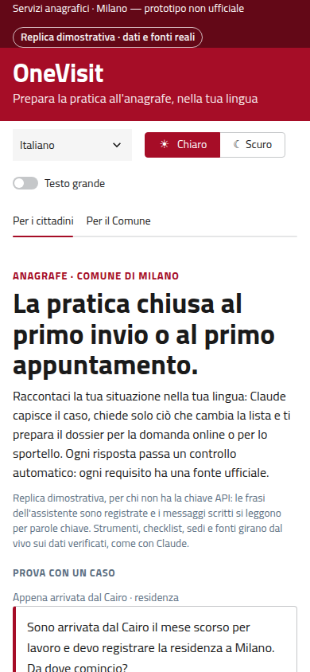
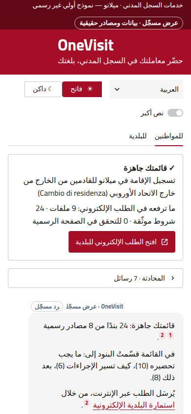
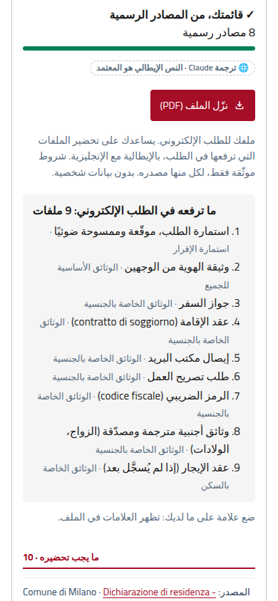
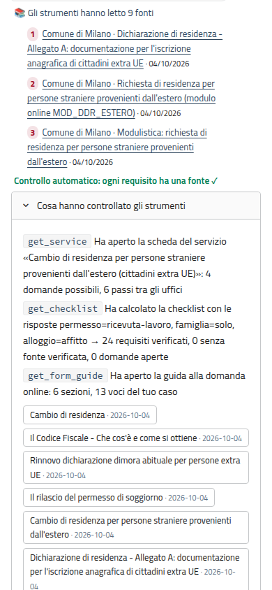
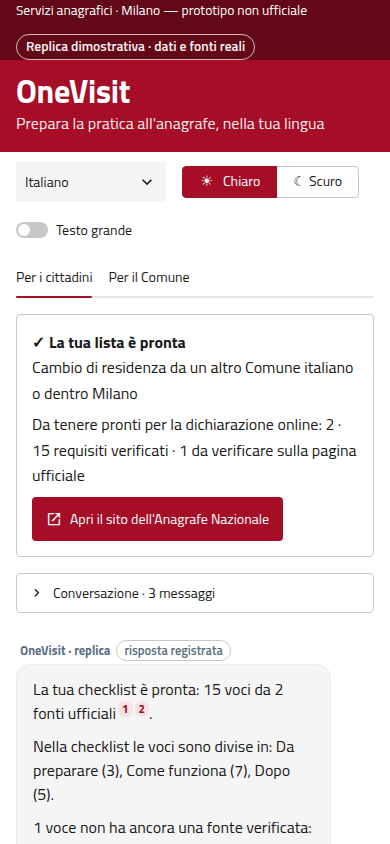

# OneVisit

> Claude Impact Lab Milano · 3 October 2026 · Track **01 · Welcome journey for people arriving in Milan**

**Done right the first time: first submission or first appointment.**

**OneVisit prepares people for the City of Milan registry office in their own language, above all newcomers who don't speak Italian.** Claude works out the case from one sentence, asks only the questions that change the answer, and builds a checklist and a PDF dossier in which every item quotes the official page it comes from. For the ID card it also answers any question from 135 saved official pages, quoting the passage word for word, and says it doesn't know, with the official link, when no saved page answers. The goal: the procedure closes the first time, at the first desk appointment or with the first online submission.

| | |
|---|---|
| **App** | https://onevisit.streamlit.app (live, Claude answers) · replay for viewers without a key: https://onevisit.streamlit.app/?demo=1 |
| **From the City's booking email** | https://onevisit.streamlit.app/?servizio=carta-identita&sede=ds549-11&data=2026-10-20&lang=en&demo=1 |
| **Pitch** | [slides](docs/slides/onevisit-pitch-v2.pptx) · [spoken script](docs/pitch/script.md) · [video](video/onevisit-final.mp4) (2:02, recorded on 3 October from the design prototype, before this version) · [3 October version of the slides](docs/slides/onevisit-pitch.pptx) |
| **Claude at runtime** | On the live link Claude (`claude-sonnet-5-5`, with the team's key in the deployment's Streamlit Secrets) does the work in every turn: it picks the service from free text in any language, asks only the questions that change the list, calls the eight tools that return verified data and the saved official pages, and explains the result in the person's language. In the City tab it classifies outcome reports and drafts page corrections for an officer to approve. **`?demo=1` is a replay** for viewers without a key: the assistant's sentences are recorded and typed messages are read by keywords, while every tool result, checklist and source is computed live from the data. What this build has and hasn't measured: [Known limits](#known-limits). |

<p align="center">
  
  
  
  
  
</p>
<p align="center"><sub>Demo replay (real data and sources), invented people: first screen · Cairo case in Arabic · files to upload · what the tools checked · a move from Turin.</sub></p>

## How OneVisit meets the jury criteria

| Criterion | What we built | Where |
|---|---|---|
| **Day-one impact** ×2 | Switched on by **one line in emails the City already sends** (booking confirmation with service, office and date; welcome email) and in the YesMilano guide: no access to City systems, no personal data in the link. Three procedures: residence from abroad, **change of residence from another comune**, ID card — 46,953 new registrations in 2024 plus every ID card. Checklist, files and dossier in Arabic, Spanish or Chinese next to the Italian that counts. The City tab's estimate, with every assumption on a slider: **about 1,000 second attempts avoided a year** on the two residence procedures alone. | [`app/deeplink.py`](app/deeplink.py), City tab |
| **AI at work** ×2 | Five Claude jobs at runtime, each checked by code: the **conversation** (8-step loop, eight tools: the case and **any question on the ID card**, answered from the saved pages), the **next 3 actions**, **translation** of missing texts, report **classification**, page-correction **drafts**. A reply with an unknown or unread source, a quote not word for word in the passages read, a number or link no tool returned, or a promise is regenerated once, then replaced by a safe fallback. `onevisit.evaluate` measures pass/fail, seconds, tokens and cost on 20 scenarios, and `--qa` on 255 ID card questions. | [`agent.py`](onevisit/agent.py), [`validator.py`](onevisit/validator.py), [`evaluate.py`](onevisit/evaluate.py) |
| **City data and sources** ×1 | 149 official pages saved verbatim (135 for the ID card: the City's page and 80 support-centre FAQs, the Ministry's CIE site, circulars, Polizia di Stato, YesMilano) and 6 City datasets. **244 facts verified word for word (226 requirements, 14 steps, 4 routes); 5 left open.** The City's own errors are shown to its staff. | [`data/`](data/), [`docs/knowledge.md`](docs/knowledge.md) |
| **Product and execution** ×1 | Two tabs (citizens, City), five languages, Arabic right to left, Italian public-administration look. Cases on the first screen; once the case is clear a summary card leads, the conversation folds and the dossier is one download at the top of the checklist. 652 app tests; the kit passes its own 512 tests (libraries and apps). | [`app/`](app/), [`tests/streamlit/`](tests/streamlit/) |
| **Pitch** ×1 | One invented person from Milan's largest foreign community, from first message to dossier, then the City's side. | [`script.md`](docs/pitch/script.md) |

## The problem

In 2024, 46,953 people registered as residents of Milan: **19,755 from abroad (42.1%)** and 27,184 from another Italian comune (`ds1959`). In the City's 2022 survey of its online residence service, **42.1% of foreign respondents said it helped them little or not at all, against 28.2% of Italians** (`ds1702`, 10,194 answers, all filled in Italian).

The rules a newcomer needs are spread across the City's service page, its forms page, a 2013 PDF list of documents, the Polizia di Stato, the Agenzia delle Entrate and YesMilano, and they change with the case: four permit situations, seven housing situations, alone or with family. Residence from abroad is an online application, one at a time: *"Il sistema non consente di inviare una nuova dichiarazione di residenza se non si è concluso l'iter della dichiarazione precedentemente inviata"* [`residenza-estero-modulo`]. The first submission has to be complete.

## Try it in 60 seconds

On https://onevisit.streamlit.app/?demo=1 (the replay, no key needed; the same steps work on the live link, where Claude writes the replies):

1. Tap **"La stessa persona scrive in arabo"**: a woman who came from Cairo for work (Egypt is Milan's largest foreign community, 41,957 residents, `ds74`). The page turns Arabic, right to left, and lays out the path across Questura, Sportello Unico, Agenzia delle Entrate and Comune, each step with its source.
2. Answer three questions: permit (the six cases of the City's document list), alone or with family, housing. For a rented room the app asks if the contract is already registered, because the City page and YesMilano ask for different files.
3. **"Your list is ready"**: 24 verified items, **9 files to upload** under the section of the City's form where each goes, the PDF dossier (Italian with Arabic), the City's online form. Under the reply: sources by name and date, the automatic check, every tool call. In the replay, replies are signed **"OneVisit · replica"**, never Claude.
4. Type *"Devo fare il cambio di residenza, mi sono trasferito da Torino"*: a different procedure (national ANPR website, SPID or CIE, 20 days), and no question about a residence permit. In a language the replay doesn't write (French, Ukrainian, Bengali, Tagalog…) it answers in English and names the language; live, Claude answers in it.
5. **"Per il Comune"**: the City's numbers, the impact estimate with its formula, the booking email with the added line (its link opens the app), a report stripped of personal data before Claude classifies it, Claude's draft correction for an officer to approve.

## Where Claude works

`claude-sonnet-5-5` (effort `medium`, server-side fallback, system prompt and tools cached within a turn) runs four jobs: the **conversation** (`run_turn` in [`agent.py`](onevisit/agent.py), up to 8 steps over the eight tools in [`tools.py`](onevisit/tools.py): six return only `verified` facts with their `source_id`; `search_official_pages` finds passages of the saved official pages and `read_source` reads one page in full, both verbatim with page, publisher and date, so Claude answers any question by quoting the deciding sentence between « » with its `[source_id]`), the **next 3 actions** ([`plan.py`](onevisit/plan.py), structured output naming checklist ids), report **classification** and page-correction **drafts** ([`outcomes.py`](onevisit/outcomes.py), after code has removed personal details). `claude-haiku-4-5` **translates** texts missing from the 187-per-language cache in [`data/i18n/`](data/i18n/) ([`translate.py`](onevisit/translate.py)).

| Claude decides | Code decides, from verified data | A person confirms |
|---|---|---|
| Which service, from free text in any language | Which requirements apply (`kb.checklist`) | The citizen taps the answers and ticks each file |
| What the first message already says ("I lost my card and I'm leaving" → lost, adult, urgent) | Every requirement, quote, step, link, office and hour | **The desk officer, or the registry office for online applications, makes the final check.** OneVisit never says documents are valid |
| Which questions to ask, in what words | The checklist groups, the files, the form sections, the PDF | A City officer approves every page correction |
| The order of the next actions, and why | Which actions survive (ids in the checklist, no promise) | A person verified each quote once against the saved page |
| A missing translation; a report's cause | Which source ids exist and were read this turn; personal data removed before Claude reads a report | The Italian text and the quote stay one tap away |

**When Claude is wrong.** [`validator.py`](onevisit/validator.py) blocks a reply citing a source that doesn't exist or wasn't read this turn, claiming eligibility in seven languages ("in regola", "eligible", "مؤهل", "符合条件", …; quotation marks don't hide them, and only a quoted official sentence may say "valida" in its own sense), stating facts without a source, quoting anything (in « », “ ”, 「」…) that is not word for word in a passage a tool returned (an ellipsis can't stitch fragments or drop a "non"), writing a number or a link no tool returned, or answering from the pages with neither a verbatim quote nor "the pages don't say". Claude's text can't add a requirement: checklist, form guide and dossier are built by code. If Claude can't be reached or a cap is hit, the session continues as the replay and says so. **Demo replay** (no key, or `?demo=1`): recorded sentences and keyword reading, both labelled; the tools, checklist, translations and sources are computed live and pass the same validator ([app/README.md](app/README.md)).

## City data and sources

| id | Publisher | What the citizen gets from it |
|---|---|---|
| `cie`, `prenotazione` | Comune di Milano | ID card: documents, cases, EUR 22.20, walk-in exceptions, temporary card, check-in on the day |
| `cie-ministero` | Ministero dell'Interno | Renew from 180 days before expiry, posted within 6 working days |
| `residenza-estero`, `-modulistica`, `-extraue` (Annex A, PDF of 2013), `-modulo` (the online form) | Comune di Milano | Residence from abroad: online application, files and formats, documents for each permit and housing case, one application at a time |
| `cambio-residenza`, `anpr-cambio-residenza` | Comune di Milano, Ministero dell'Interno (ANPR) | Moving from another comune or within Milan: online on ANPR with SPID or CIE, 20 days, free, what to have at hand, 2 days to register, at most 45 days of checks |
| `dimora-abituale` | Comune di Milano | Renew the habitual-abode declaration within 60 days of each permit renewal |
| `permesso-soggiorno`, `permesso-soggiorno-come` | Polizia di Stato | Apply within 8 working days of entry; where and how |
| `codice-fiscale` | Agenzia delle Entrate | Who assigns the tax code: Questura, Sportello Unico or an Agenzia appointment |
| `yesmilano-students`, `-permesso`, `-codice-fiscale` | YesMilano | The City's student path: corrections, home check, name on the intercom |
| `ds549`, `ds1959`, `ds1702`, `ds1511`, `ds1512`, `ds74` | City open data (CC BY) | The 13 offices; who arrives and from where; the survey baseline; which languages first |

| `cie-faq-*` (80), `cie-ministero-*`, `circ-dait-*`, `pds-*`, `news-cie-*` | Comune di Milano (support centre), Ministero dell'Interno, Polizia di Stato | Answers to ID card questions: PIN/PUK, delivery, minors, travel, photo, digital identity, organ donation, lost cards, walk-in cases |

Each verified fact holds a verbatim quote that [`data/tools/validate.py`](data/tools/validate.py) finds in the saved page, or the push fails. **How the knowledge is built and refreshed** ([docs/knowledge.md](docs/knowledge.md)): Claude can't read the sites live (the City's firewall answers 403 to programs), so `data/tools/crawl.py discover` finds candidate pages (allowlist, robots.txt, 1-3 s per host, an honest `OneVisitCrawler` user agent; a 403 is a refusal: ask the site or save the page by hand), a person picks them, `crawl.py ingest` saves each with its date and content hash in status `review`, and `crawl.py approve` makes it searchable after a person has read it; `crawl.py refresh` tells which saved pages changed on the official sites. Per-page counts: [data/README.md](data/README.md).

**What the City's own sources get wrong** (shown to staff, in the data as `unknowns_it` and `data_issues`):

- **Annex A is out of date:** a 2013 PDF asking for "originale e fotocopia" for an application that today is an online upload of scans. It covers four permit cases only: a student waiting for a first study permit is not covered, and OneVisit says it doesn't know.
- **A registered rental contract:** the City page lists no file for it; YesMilano asks for the contract with its registration details. OneVisit asks which case applies and shows one file, with its source.
- **`ds549`:** the via Larga 12 entrance is still called "INGRESSO PROVVISORIO" while the City's ID card page gives it as the entrance; the Via Passerini 5 office still says "lunedì 5 gennaio 2026: CHIUSO".
- **The tax code from abroad:** the Agenzia delle Entrate says a consulate can issue it; YesMilano (May 2025) says it no longer can.

## Day one

**Expected impact (an estimate, not a result).** The City tab computes *second attempts avoided per year ≈ (19,755 registrations from abroad × share who must submit again + 27,184 registrations from other Italian comuni × share who must declare again) × share who use OneVisit × share of second attempts avoided for users*. The two bases are the 2024 figures of `ds1959`; the four shares are assumptions on sliders, starting at 20%, 10%, 30% and 50%, which gives **about 1,000 a year**. A second attempt is an application sent again or a return to the desk. ID cards are left out: no saved source or dataset in `data/` says how many the City issues a year.

**What the City needs to switch it on:** one line with a link in the booking-confirmation email (`?servizio=carta-identita&sede=ds549-11&data=2026-10-20`), the same line in the welcome email and the YesMilano guide (`?servizio=iscrizione-anagrafica-extra-ue&canale=yesmilano`), and the pages it already publishes. On day one OneVisit doesn't need to know who has just arrived: it sits in the channels a newcomer already passes through. Making it **proactive** needs, in order: the status of the residence file from ANPR through a PDND e-service (legal basis and DPIA, owner: the City registrar), SPID/CIE login, and reminders on App IO. The City tab lists each step with its data, owner and privacy rule.

**Cost and operation**

| Item | Today |
|---|---|
| Tokens and euros per completed case | **Not measured yet** (this build was prepared without a key). `python -m onevisit.evaluate --usd-to-eur <rate>` runs the 20 scenarios through the app's own `run_turn` and writes `docs/eval-results.md`: API requests, seconds, tokens (input, cache, output, from `response.usage`) and list-price cost per scenario and per turn |
| Prices used | `claude-sonnet-5-5` $2 in / $10 out per million tokens, cache reads $0.20; `claude-haiku-4-5` $1 / $5 |
| Spending caps | 40 Claude jobs per browser session, 1,500 per day per server; a turn is at most 8 API requests (16 if regenerated); past a cap, the replay |
| Keeping facts true | One officer per service verifies the quotes once, about 5 minutes per page; `onevisit ingest` warns when a page's content hash changed and lists the requirements to re-verify; `validate.py` blocks a push with a quote not in its page |
| Translations | Claude's, labelled; before adoption a native speaker per language reviews the 187 texts once, then each changed text |
| Corrections · hosting | Claude drafts from at least 5 reports, the office owning the page approves · Streamlit Cloud today, the kit (Docker, PostgreSQL) for the City |

## The ID card: coverage and how well questions are answered

- **Case**: 167 requirements, **164 verified** word for word (3 open), 5 deciding questions with their routes (not served in Milan, home service, lost PIN/PUK at any desk, no visit needed).
- **Questions**: a bank of 255 realistic questions in 8 languages ([`data/eval/qa/`](data/eval/qa/)), 48 kept apart as a holdout. The search alone puts the right passage in its top 3 for **90% of the tuning questions and 85% of the holdout** (hit@1 69% and 60%). The **replay** (no key) shows a card holding the answer for 66% of typed tuning questions and **56% of holdout ones**, and gives the honest "the saved pages don't say" for 12 of the 20 questions no page answers ([RESULTS.md](data/eval/qa/RESULTS.md)). The holdout was seen once during fixes, so read it as a near-tuning set.
- **Live Claude** answers with the same tools but reads the passages; its accuracy on the bank is **not measured** (no key here): `python -m onevisit.evaluate --qa`.

## Known limits

- **Not run against the API in this build.** This build was prepared without a key, so no figure here comes from a live run. Every Claude path (conversation, next actions, translation, classification, drafts) is tested with a fake client; with a key, `python -m onevisit.evaluate` runs the 20 scenarios and writes `docs/eval-results.md` (pass/fail, seconds, tokens, cost). The first version ran end to end with real Claude on 3 October.
- **Three services.** EU citizens arriving from abroad are not covered yet: the app asks where the person comes from and doesn't guess. 5 of 231 requirements stay open, among them how to declare a move without SPID or CIE.
- **The replay's answers are lexical.** Without a key, a question is answered by a keyword search plus a concept map: it can quote a page on the same topic that doesn't answer (8 of 20 unanswerable questions still get passages), always under "these are the pages' words, check the official page". Live, Claude reads the passages; its accuracy is not measured without a key (`python -m onevisit.evaluate --qa`).
- Translations are Claude's, labelled, not yet reviewed; the online-form guide follows the City's Modulistica page, not the form's fields (behind a login); the City tab's reports are simulated and its impact figure is an estimate on assumed shares.

## Run it

```bash
python -m venv .venv && source .venv/bin/activate
pip install -r requirements.txt
cp .env.example .env                 # optional: ANTHROPIC_API_KEY for the live version
streamlit run app/streamlit_app.py   # no key, or ?demo=1: the demo replay
python data/tools/validate.py        # every verified fact quotes its source: prints OK
pip install -r tests/requirements.txt && python -m pytest tests/streamlit -q
python -m onevisit.evaluate --transcripts docs/eval-transcripts   # with a key -> docs/eval-results.md
```

Streamlit Community Cloud: main file `app/streamlit_app.py`, `ANTHROPIC_API_KEY` in Secrets ([template](.streamlit/secrets.toml.example)).

**Production path, the OneVisit kit** (`apps/`, `libs/`, Python 3.13, FastAPI, HTMX, PostgreSQL): the same `data/` with the same "verified only" rule, a web chat, email/SMS reminders that never name the procedure, a City panel with no group under 5 cases, and personal data only in a separate `pii` schema the panel's role can't read. `make env && make demo`. Documentation in Italian: [architecture](docs/architecture.md), [privacy](docs/privacy.md), [status](docs/progress.md).

More: [app details, the demo replay, link parameters, privacy and all screenshots](app/README.md) · [sources and how they were verified](data/README.md).

## In breve (italiano)

OneVisit prepara chi va all'anagrafe del Comune di Milano, soprattutto chi è appena arrivato e non parla bene l'italiano. La persona scrive nella sua lingua; Claude capisce la pratica, chiede solo ciò che cambia la lista e costruisce una checklist e un dossier PDF in cui ogni voce cita la frase esatta della pagina ufficiale. Copre tre pratiche: la residenza per chi arriva dall'estero (domanda online al Comune), il cambio di residenza da un altro Comune o dentro Milano (dichiarazione online sull'Anagrafe Nazionale) e la carta d'identità. Usa 149 pagine ufficiali salvate e 6 dataset del Comune: **244 voci verificate parola per parola (226 requisiti, 14 passaggi, 4 strade alternative), 5 aperte** perché nessuna fonte le chiarisce. Sulla carta d'identità risponde a qualsiasi domanda citando parola per parola il passaggio della pagina ufficiale salvata, e dice di non sapere, con il link ufficiale, quando nessuna pagina risponde. Un controllo automatico blocca ogni risposta senza fonte e ogni frase del tipo "sei in regola": decide l'operatore. Per attivarlo basta una riga con un link nelle mail che il Comune già manda e nella guida YesMilano. **La pratica chiusa al primo invio o al primo appuntamento.** Sul link pubblico risponde Claude, con la chiave del team; `?demo=1` è una replica per chi non ha la chiave, con dati e fonti veri e le risposte firmate "OneVisit · replica". Questa build è stata preparata senza chiave: i percorsi di Claude sono provati con un client finto, e i numeri su costo e qualità arriveranno solo da `python -m onevisit.evaluate`.

## Team

| Name | GitHub |
|---|---|
| Mohammad Nouri Zadeh | [@mohammad-nouri-zadeh](https://github.com/mohammad-nouri-zadeh) |
| Rosario Barbagallo | [@Saroth85](https://github.com/Saroth85) |
| Leonardo Silvani | [@leonardosilvani-ops](https://github.com/leonardosilvani-ops) |
| Marcelo Kaihara | [@mkaihara](https://github.com/mkaihara) |
| Eugène Wirtz | |

## Licence

MIT. Built at the Claude Impact Lab Milano and donated to the Comune di Milano. Not an official City of Milan service. The people in the examples are invented; the repo holds no personal data.
