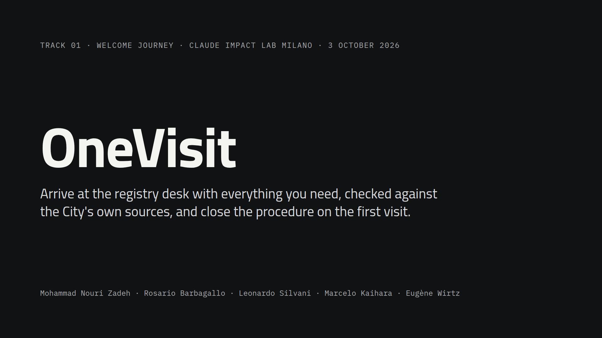

# OneVisit

**Pitch slides:** [PowerPoint](docs/slides/onevisit-pitch.pptx) · [PDF](docs/slides/onevisit-pitch.pdf) (7 slides; speaker notes in the PowerPoint)

[](docs/slides/onevisit-pitch.pdf)

> Claude Impact Lab Milano · 3 October 2026 · Track **01 · Welcome journey for people arriving in Milan** (team: change here and in the submission form if you pick 03)

**One line:** for people who go to a City of Milan registry desk, above all newcomers who don't speak Italian, OneVisit checks with them, in their language and from official sources, what they need before the appointment, so the procedure closes the first time.

**Demo video:** [`video/onevisit-final.mp4`](video/onevisit-final.mp4) (2:02) · **Live app:** https://onevisit.streamlit.app (paste an Anthropic API key in the sidebar if asked)

## The problem

In 2024, **19,755 people registered in Milan arriving from abroad**, 42.1% of all new registrations (City open data, `ds1959`). When the City surveyed users of its online residence service in 2022, **42.1% of foreign respondents said it helped them little or not at all, against 28.2% of Italians**; for foreign newcomers' residence requests the figure was 46.2% (`ds1702`, 10,194 answers). Online certificates, by comparison, left only 2.3% unhelped (`ds1512`).

When a document turns out to be missing at the desk, the citizen has to book and wait again, and the City loses a slot someone else could have used.

## What we built

**For citizens** (`app/streamlit_app.py`, tab "For citizens"):
1. The person describes their situation in any language. Tested in Arabic, English, Spanish and Italian.
2. Claude works out the service and asks only the questions that change the answer, as tap buttons.
3. A checklist where every item shows its source and the date it was checked. Items without a verified source are shown as unknown, with a pointer to comune.milano.it.
4. The nearest registry office from City open data, with hours and booking without SPID.
5. A calendar reminder three days before (`.ics`, no email needed).
6. After the appointment: one question. Claude classifies the problem and removes personal details; the citizen's own words are not stored.

**For City staff** (tab "For City staff"): real City statistics, errors found in the City's own office dataset, reports grouped by cause with a threshold of 5 before they reach an office, and a correction drafted by Claude that a City officer approves.

Clickable design prototype: [`design/onevisit-prototype.html`](design/onevisit-prototype.html).

## Where Claude works

What Claude does every time someone uses OneVisit:

- **Model:** `claude-sonnet-5-5` (set with `CLAUDE_MODEL`), through the Anthropic API, with server-side fallback if a request is declined.
- **Conversation** (`onevisit/agent.py`): Claude reads the citizen's message, picks the service, decides which deciding questions to ask, calls the tools, and answers in the citizen's language. The system prompt is `SYSTEM` in that file.
- **Tools** (`onevisit/tools.py`, backed by `onevisit/kb.py`): `list_services`, `get_service`, `get_checklist`, `find_offices`, `get_source`. They return only facts marked `verified`: each has a verbatim quote that `data/tools/validate.py` found in the saved official source.
- **After the appointment** (`onevisit/outcomes.py`): Claude classifies each report into one of six causes (page incomplete, procedure out of date, no page for the case, wrong office, page not followed, request not in the procedure) and rewrites it as one anonymous sentence, with structured output.
- **For City staff:** Claude drafts the correction for the page from a group of reports.
- **What a human confirms:** the citizen confirms their case; the desk officer makes the final check (OneVisit never says documents are valid); a City officer approves every correction before anything changes.
- **When it's wrong:** Claude may state a City rule only if a tool returned it, with its source id in brackets. Anything not verified is shown as unknown. A wrong verified fact is traceable to its quote and source, and the validator fails if a quote is not in the saved page.

## City data and sources

| Source | How we used it |
|---|---|
| `ds549` Sedi dei servizi anagrafici (retrieved 3 Oct 2026; resource modified 28 Jan 2026) | The 13 registry offices: address, hours, booking rules, coordinates. Cleaning found a stale note still saying "lunedì 5 gennaio 2026: CHIUSO" and missing fields |
| `ds1702` survey of the online residence service, 2022 | Equity baseline for the panel: 42.1% foreign vs 28.2% Italian respondents helped little or not at all |
| `ds1511`, `ds1512` surveys of online appointments and certificates, 2021 | Comparison with services that work online |
| `ds1959` registrations by previous residence, 2020–2024 | Size of the user group |
| `ds74` foreign residents by citizenship, 2025 | Which languages to offer first |
| comune.milano.it service pages | Requirements, quoted word for word once saved (see `data/README.md`); until then they are shown as unknown |

All sources with retrieval dates: [data/sources.csv](data/sources.csv). What the numbers say: [data/context/README.md](data/context/README.md).

## Day one

The City already has what OneVisit needs: its service pages, its open data and the welcome emails it sends to new residents. To switch it on:
- save the service pages for each procedure and confirm the requirements (`data/services/`), with the office that owns each procedure;
- add a link to OneVisit in the existing welcome emails;
- name the people who approve corrections in the staff panel.

Version 2: more procedures, the panel connected to real appointment outcomes, and the production architecture on branch `claude/busy-mccarthy-uq5xoi` (Docker, PostgreSQL with personal data kept separate from analytics, email and SMS reminders).

## Run it

```bash
git clone https://github.com/mohammad-nouri-zadeh/onevisit
cd onevisit
python -m venv .venv && source .venv/bin/activate
pip install -r requirements.txt
cp .env.example .env               # add your ANTHROPIC_API_KEY
streamlit run app/streamlit_app.py
python data/tools/validate.py      # checks that every verified fact quotes its source
```

## Team

| Name | GitHub |
|---|---|
| Mohammad Nouri Zadeh | [@mohammad-nouri-zadeh](https://github.com/mohammad-nouri-zadeh) |
| Rosario Barbagallo | [@Saroth85](https://github.com/Saroth85) |
| Leonardo Silvani | [@leonardosilvani-ops](https://github.com/leonardosilvani-ops) |
| Marcelo Kaihara | [@mkaihara](https://github.com/mkaihara) |
| Eugène Wirtz | |

## Licence

MIT. Built at the Claude Impact Lab Milano and donated to the Comune di Milano. Not an official City of Milan service.
