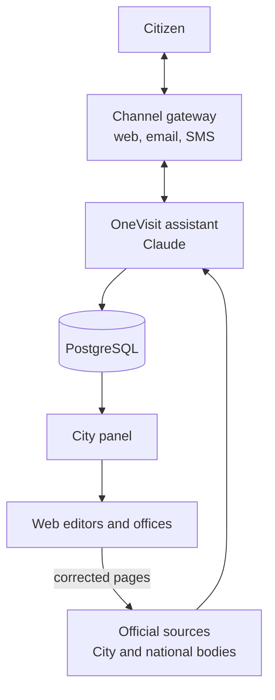
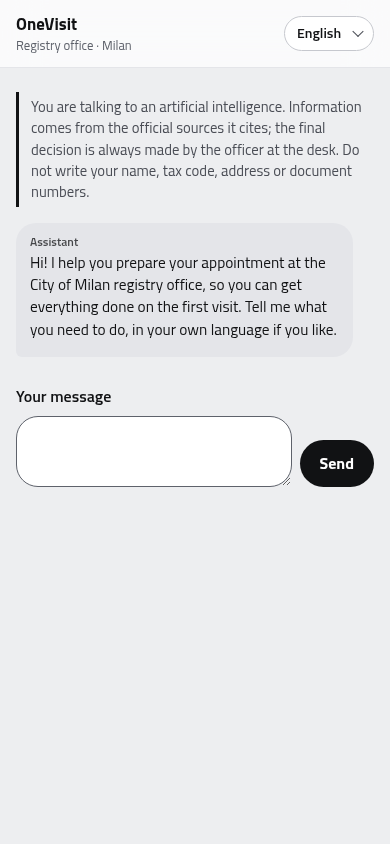
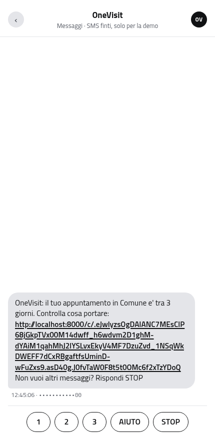
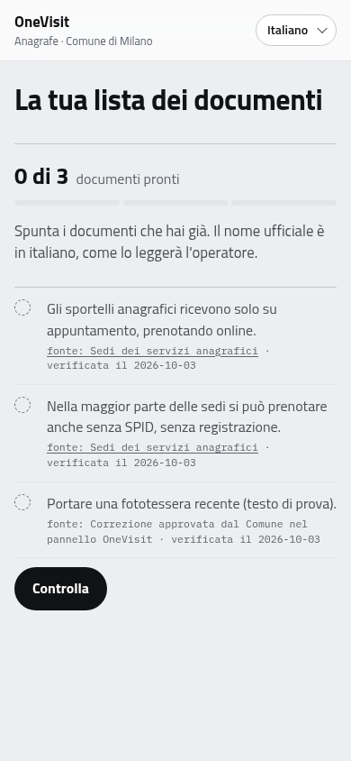
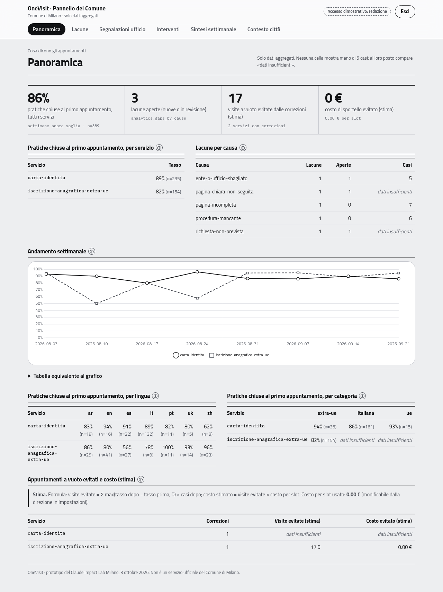
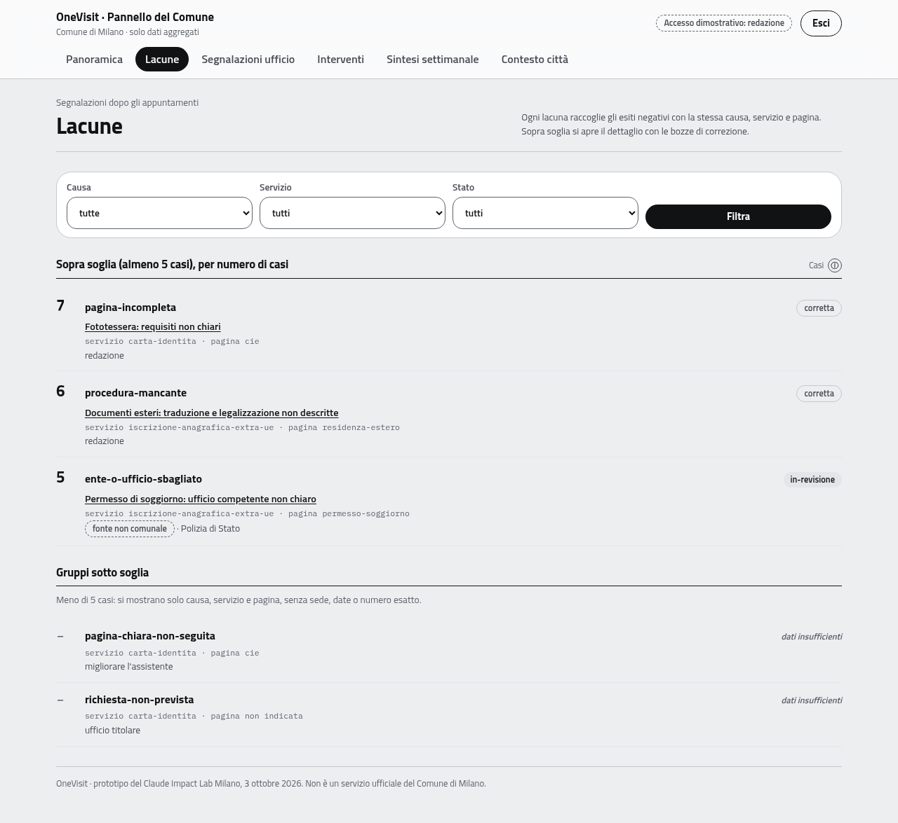

# OneVisit

> Claude Impact Lab Milano · 3 October 2026 · Track **TODO: 01 or 03, decide as a team** (the concept suggests 03, "From inside City Hall": see [docs/concept-v2.md](docs/concept-v2.md))

**One line:** for people who go to a City of Milan registry desk (above all non-EU newcomers), OneVisit checks with them, from official sources, everything they need before the appointment, so the procedure closes on the first visit.

**Problem and solution in one sentence:** people find out at the desk that a document is missing and have to book again, wasting a slot someone else needed; OneVisit uses Claude to prepare each case against verified official sources before the visit, and turns every failed appointment into a correction the City can approve and measure.

**Demo video:** TODO (link here once uploaded; story E3)

> **In italiano.** OneVisit accompagna chi va all'anagrafe di Milano, soprattutto i cittadini extra-UE appena arrivati, dal bisogno allo sportello: quale servizio, quale ente e in che ordine, quale ufficio, come prenotare, cosa portare, con ogni requisito citato da una fonte ufficiale verificata. Dopo l'appuntamento raccoglie com'è andata e, nel pannello del Comune, Claude raggruppa le lacune e scrive le bozze di correzione che la redazione approva. L'obiettivo: la pratica si chiude al primo appuntamento. Documentazione in italiano: [architettura](docs/architecture.md), [privacy](docs/privacy.md), [metriche](docs/metrics.md), [runbook](docs/runbook.md).

## The problem

Daniel, a Brazilian engineer who has just moved to Milan, books an appointment at the registry office, waits, goes, and finds out at the desk that something is missing. He has to book again. The slot he used could have served someone else.

The City's own data says this hits newcomers hardest: in the 2022 survey of the online residence service (`ds1702`, 10,194 responses), 42.1% of foreign respondents said it helped little or not at all, against 28.2% of Italians; 46.2% for foreign citizens arriving from abroad. In 2024, 19,755 people registered in Milan arriving from abroad (`ds1959`).

The full concept, in Italian, is in [docs/concept.md](docs/concept.md) and, extended with the kit, in [docs/concept-v2.md](docs/concept-v2.md).

## How it works



Two products share one database:

- **The assistant** (web chat, plus reminders by email or SMS): understands the case in the citizen's language, explains which bodies to visit and in what order, links to the City's booking page, builds a checklist where every item cites an official source, reminds the citizen before the appointment and asks afterwards how it went.
- **The panel** for City staff, separate from the bot: first-visit closure rates, gaps grouped by cause, Claude's correction drafts for the editors to approve, and the before/after effect of each correction.

More: [docs/architecture.md](docs/architecture.md) (all four diagrams, flows, trust boundaries), [docs/contracts.md](docs/contracts.md) (interfaces), [docs/adr/](docs/adr/) (decisions).

## What we built

Built today:

- **A sourced knowledge base** (`data/`): every requirement carries a verbatim quote from an official page or City dataset and the date it was checked. A validator rejects any fact whose quote isn't in the saved source.
- **Registry offices from City open data** (`data/offices.json`, from dataset `ds549`), cleaned, with the dataset's own errors flagged.
- **Tools for the agent** (`onevisit/tools.py`): list services, get the deciding questions, get the checklist for this case, find offices, cite a source.
- **The OneVisit kit** (`apps/`, `libs/`): a uv monorepo with the citizen web chat (`apps/assistant_web`), the City panel (`apps/dashboard`), the channel gateway with SMS webhook, reply links, a fake phone for the demo and the reminder loop (`apps/gateway`), and libraries for the knowledge catalog, the Claude agent and reply validator, the privacy pipeline, the database (schemas `pii`/`core`/`analytics` with separate roles), channels and analytics. Status per story: [docs/progress.md](docs/progress.md).

Screenshots from the running apps, with synthetic demo data only (`onevisit seed-demo`, 400 invented cases). Design system: [docs/design-system.md](docs/design-system.md), from the team's prototype.

| Web chat on a phone (browser in English) | The reminder SMS on the demo phone | The personal checklist it links to |
|---|---|---|
|  |  |  |

| City panel: overview, k = 5 | City panel: gaps, below-threshold groups apart |
|---|---|
|  |  |

More: [a gap with its three correction drafts](docs/screenshots/panel-gap-detail.png), [interventions before/after](docs/screenshots/panel-interventions.png), [City context from open data](docs/screenshots/panel-context.png), [demo login](docs/screenshots/panel-login.png), [chat on desktop](docs/screenshots/chat-welcome-en-desktop.png).

## Quick start

With only Docker and make installed:

```bash
make env     # creates .env from .env.example; add ANTHROPIC_API_KEY and the four 32-byte keys
make demo    # starts everything in demo mode (1 day = 60 s) and loads the synthetic scenario
```

| Service | URL |
|---|---|
| Citizen web chat | http://localhost:8000 |
| City panel | http://localhost:8001 |
| Gateway (SMS webhook, reply links, fake phone at `/demo/phone`) | http://localhost:8002 |
| Mailpit (test inbox, no email leaves the machine) | http://localhost:8025 |

Checks, reset, offline fallback, SMS trial notes and the no-Docker-build alternative: [docs/runbook.md](docs/runbook.md). `make help` lists every command; `make test` runs ruff, mypy strict and pytest with Postgres.

## Where does Claude work when someone uses this?

| Moment | What Claude does | What a human confirms |
|---|---|---|
| Understanding the case | Recognises the citizen's language from the first message (or the one they ask for) and identifies the service and variant from a free description | The citizen confirms the summary of their case |
| Asking the deciding questions | Asks only the questions that change the answer (catalog `deciding_questions`), including the deadline | The citizen answers; nothing is asked about identity |
| Bodies and office | Explains which bodies are involved and in what order (Questura, Agenzia delle Entrate, City registry) and which office, from catalog tools, with sources | The citizen books on the City's official system; OneVisit never books |
| Checklist with citations | Builds the checklist for this case from verified requirements only, each with `[fonte: source_id]`, and goes through it item by item before the appointment | The desk officer decides; OneVisit never says documents are "valid" or "eligible" |
| Reply validator | Every reply is checked before it is shown: unknown sources, missing citations or eligibility words ("idoneo", "in regola", "garantito", "eligible", ...) block it; one regeneration, then a polite fallback with the official link | The data owner verifies every quote in the catalog (`status: "verified"`, `validate.py`) |
| Privacy pipeline | Regex first, then `claude-haiku-4-5-20251001` removes personal data and turns outcomes into structured fields; free text is never stored | — (nothing leaves before a group reaches the k=5 threshold) |
| Gaps and correction drafts | Classifies each failed outcome into one of six causes, groups similar cases, names the right recipient and drafts the correction in Italian, plain Italian and English | The web editors (redazione) edit and approve every correction before it reaches the assistant |
| Weekly summary | Writes a plain-language summary of the week for City managers | Managers read it next to the numbers it cites |

**Models:** `claude-sonnet-5-5` for conversation, correction drafts and the weekly summary; `claude-haiku-4-5-20251001` for personal-data removal and short classifications. Catalog and tool definitions use prompt caching.

**Prompts and tools:** system prompt in `libs/onevisit_agent/src/onevisit_agent/prompts/system.md`; agent tools `identify_case`, `get_procedure`, `get_office`, `build_checklist`, `record_appointment`, `request_contact`, `record_outcome`, `report_missing_procedure`, backed by `libs/onevisit_knowledge`, which reads the same files as [`onevisit/tools.py`](onevisit/tools.py) and [`onevisit/kb.py`](onevisit/kb.py).

**What happens when it's wrong:** Claude can only state requirements returned by the catalog tools, which return only facts whose quote was checked against the saved source. When a requirement isn't verified, Claude says it doesn't know and links the official page. The validator blocks uncited facts and eligibility claims. A wrong classification of a gap is caught by the editors before approval. If the citizen still finds something missing at the desk, that outcome becomes a gap in the panel: the mistake feeds the correction loop. Agent changes are checked against synthetic evaluation scenarios (`data/eval/`, `onevisit eval`); no model is trained on citizens' data.

**"Turn off the AI" test:** without Claude, what's left is a page of links, a complaint form and a dashboard of counts. With Claude: the case understood in the citizen's language, the bodies in order, a checklist for this case, the diagnosis of each gap, a ready correction and the measure of its effect.

## Privacy choices

- **Facts, not identity.** The assistant never asks for name, tax code, address, document photos, credentials or booking number, and never books for the citizen.
- **Contact is the one declared exception:** email or phone, optional, asked only after booking, with separate consent for reminders, follow-up and correction notices; revocable with STOP or a link. Without a contact the citizen gets an `.ics` calendar event.
- **Separate schemas and roles:** contacts are encrypted in schema `pii`; cases in `core` hold only structured fields; the panel's database role can read only aggregates (`analytics`, with cells under k=5 hidden inside the views), gaps and interventions, and gets a permission error on `pii` and on cases.
- **Minimal notifications:** SMS and email never name the procedure, only the days left and a personal signed link.
- **No personal data in logs**; free text is never stored. All demo data is synthetic.

Details, processors (Anthropic, SMS provider, email provider) and open questions for the DPO: [docs/privacy.md](docs/privacy.md). Data model: [docs/data-model.md](docs/data-model.md).

## Known limits

- **Few verified requirements yet.** Only 2 requirements are `verified` today (both from `ds549`); the service pages `cie`, `residenza-estero`, `prenotazione`, `permesso-soggiorno` and `codice-fiscale` still have to be saved and quoted. Until then the assistant says "I don't know" and links the official page for those items. Inventory and gaps: [docs/sources-inventory.md](docs/sources-inventory.md).
- **Network-blocked ingestion.** The cloud sandbox cannot reach comune.milano.it: pages must be saved from a browser and imported with `onevisit ingest <id> --html <file> --url <url>` (or `python data/tools/save_page.py`).
- **SMS via a fake provider** (visible at `/demo/phone`) unless Twilio trial credentials are set in `.env`; a trial account can only text verified numbers.
- **Panel numbers are synthetic** (`make seed-demo`, fixed seed); the cost saved is an estimate that likely overestimates the effect, and the cost per slot must come from the City. Definitions: [docs/metrics.md](docs/metrics.md).
- Booking is simulated by a link to the City's official page; automatic deletion at the end of follow-up and month-level date coarsening are designed but not yet automated.

## City data and sources

| Source | How we used it |
|---|---|
| `ds549-sedi-dei-servizi-anagrafici` (retrieved 3 Oct 2026; resource last modified 28 Jan 2026) | The 13 registry offices: address, hours, booking rules, coordinates. Cleaning found a stale note ("5 gennaio 2026: CHIUSO") and missing fields |
| `ds1702` survey of the online residence service, 2022 (10,194 responses) | 42.1% of foreign respondents said it helped little or not at all, vs 28.2% of Italians; 46.2% for foreign newcomers' residence requests. Baseline for the panel |
| `ds1511`, `ds1512` surveys of online appointments and certificates, 2021 | Comparison: certificates online leave 2.3% unhelped, residence 30.4% |
| `ds1959` registrations by previous residence, 2020–2024 | 19,755 people registered arriving from abroad in 2024: the size of our user group |
| `ds74` foreign residents by citizenship, 2025 | Which languages to support first |
| comune.milano.it service pages (TODO, see [data/sources.csv](data/sources.csv)) | Requirements for each service, quoted word for word |

Full list with retrieval dates: [data/sources.csv](data/sources.csv). Inventory and evident gaps: [docs/sources-inventory.md](docs/sources-inventory.md). What the numbers say: [data/context/README.md](data/context/README.md). How the data works: [data/README.md](data/README.md).

## Day one

What the Comune needs to switch it on:

1. **The requirements, verified once by the office that owns each procedure.** The City already publishes the pages; each requirement becomes `"status": "verified"` only with a verbatim quote (`onevisit ingest` saves the page, `onevisit catalog-check` checks every quote).
2. **A link in the confirmation email the booking system already sends** ("prepare your appointment with OneVisit"): no change to the booking system itself, OneVisit never books.
3. **Infrastructure it already has or can procure:** a Linux server with Docker (`make deploy`, Caddy for HTTPS), the institutional SMTP, an EU-based SMS provider, staff login (OIDC) for the panel.
4. **One number for the estimate:** the average cost of a desk slot (panel settings, direzione role).
5. **A DPIA with the DPO**, starting from [docs/privacy.md](docs/privacy.md).

From the design so far: the official service pages to quote (the City already publishes them), the average cost of a desk slot for the estimate, a hook into the confirmation emails the booking system already sends, an EU-based SMS provider and the institutional SMTP, staff login for the panel, and a DPIA with the DPO ([docs/privacy.md](docs/privacy.md)).

## Run it

The prototype tools, without Docker:

```bash
git clone https://github.com/mohammad-nouri-zadeh/onevisit
cd onevisit
python -m venv .venv && source .venv/bin/activate
pip install -r requirements.txt
cp .env.example .env               # add your ANTHROPIC_API_KEY
python data/tools/validate.py      # check the data
python -m onevisit.tools           # try the tools without the API
```

The full stack: see [Quick start](#quick-start) (`make env`, then `make demo`) or, without Docker builds, `uv sync --all-packages` as described in [docs/runbook.md](docs/runbook.md).

## Documentation

| Document | What it covers |
|---|---|
| [docs/architecture.md](docs/architecture.md) | Diagrams, repository structure, flows, trust boundaries |
| [docs/adr/](docs/adr/) | Nine architecture decisions |
| [docs/data-model.md](docs/data-model.md) | ER diagram, tables, roles, retention |
| [docs/privacy.md](docs/privacy.md) | Data map, processors, impact assessment, DPO questions |
| [docs/metrics.md](docs/metrics.md) | Every panel number: formula, source, threshold, limits |
| [docs/sources-inventory.md](docs/sources-inventory.md) | Official sources and gaps |
| [docs/runbook.md](docs/runbook.md) | Start, check, reset, offline fallback |
| [docs/video/script.md](docs/video/script.md) | Two-minute video script and storyboard |
| [docs/backlog.md](docs/backlog.md), [docs/progress.md](docs/progress.md) | Stories and status |

## Team

| Name | Role | GitHub |
|---|---|---|
| Mohammad Nouri Zadeh | Data and sources | [@mohammad-nouri-zadeh](https://github.com/mohammad-nouri-zadeh) |
| TODO | Agent, apps (web chat, panel, gateway) and the OneVisit kit | [@Saroth85](https://github.com/Saroth85) |
| TODO | TODO | [@mkaihara](https://github.com/mkaihara) |
| TODO | TODO | [@leonardosilvani-ops](https://github.com/leonardosilvani-ops) |

## Licence

MIT. Built at the Claude Impact Lab Milano and donated to the Comune di Milano.

Note for the team: the kit's backlog declares EUPL-1.2 (story D5), while [LICENSE](LICENSE) currently is MIT. Pick one before submission and make this section and `LICENSE` agree.
