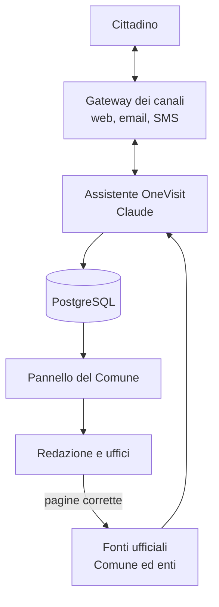
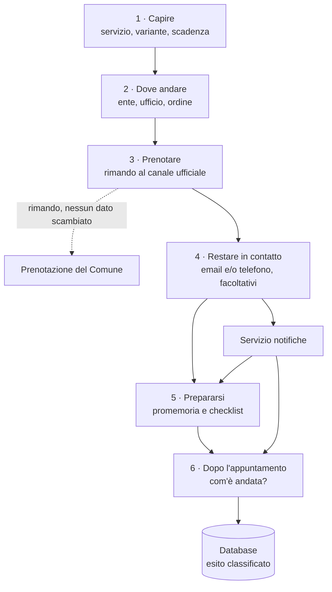
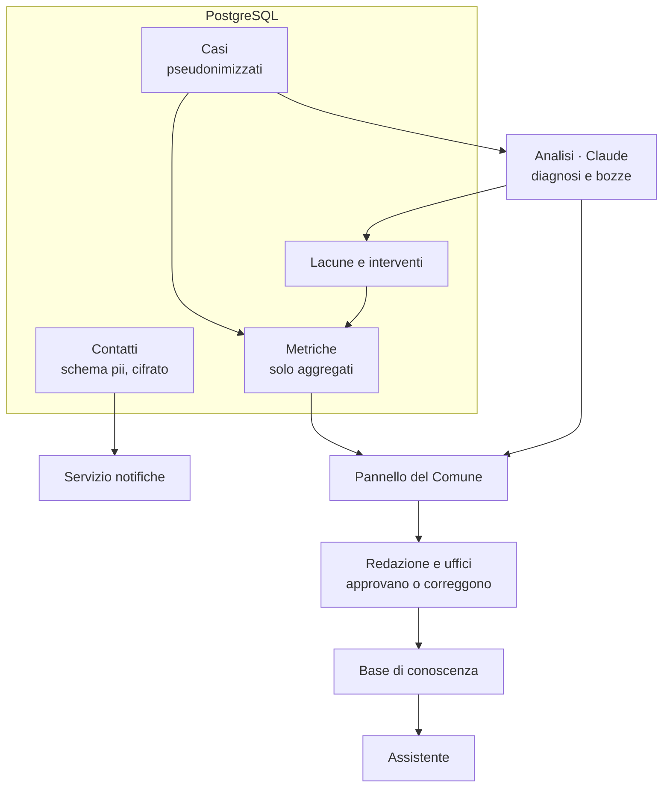
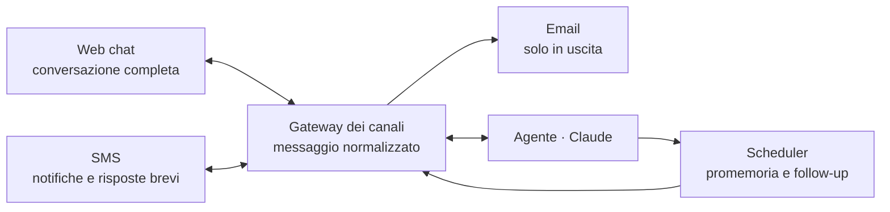
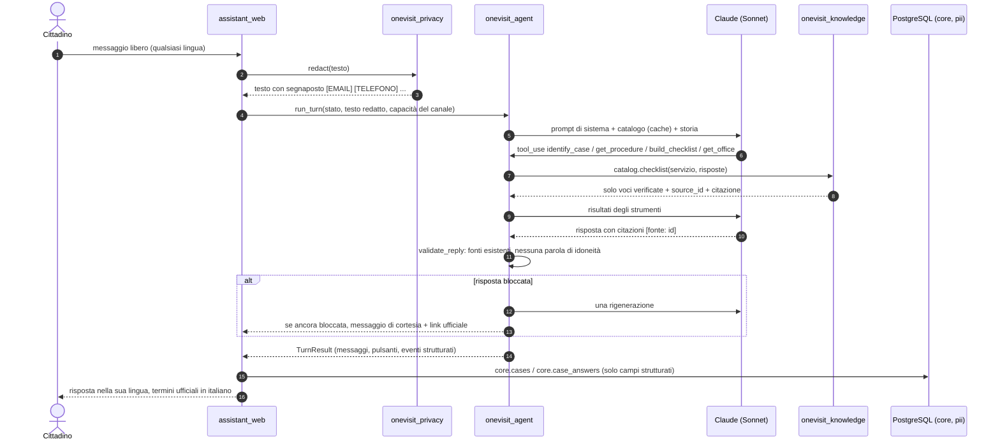
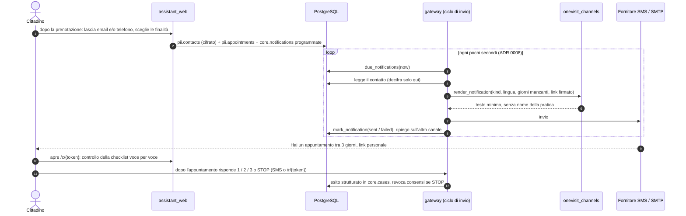
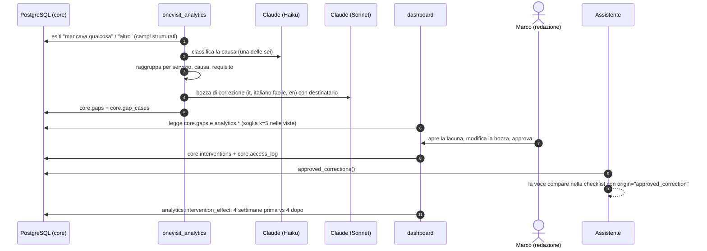

# Architettura di OneVisit

*Storia A3. Documento di riferimento per il team e per la giuria. Le interfacce tra i pacchetti sono fissate in [contracts.md](contracts.md); le decisioni sono negli [ADR](adr/). Concept completo: [concept-v2.md](concept-v2.md).*

## In breve

OneVisit è fatto di due prodotti che condividono un database PostgreSQL:

- l'**assistente** (web chat del cittadino, più promemoria via email e SMS), in cui Claude capisce il caso, indica enti e ufficio, costruisce la checklist con le fonti e raccoglie l'esito;
- il **pannello** del Comune, separato dal bot, in cui Claude classifica gli esiti, raggruppa le lacune, scrive le bozze di correzione e la sintesi settimanale. Una persona approva.

Claude non inventa i requisiti: li prende dal **catalogo** (livello dati del team: `data/services/*.json`, `data/sources.csv`, `data/pages/`), dove ogni requisito mostrato al cittadino ha una citazione letterale da una fonte ufficiale salvata ([ADR 0003](adr/0003-catalogo-fonte-dei-requisiti.md), [ADR 0007](adr/0007-catalogo-dal-livello-dati-del-team.md)).

## I quattro schemi del concept

### Schema 1 · Panoramica del sistema



### Schema 2 · Il percorso del cittadino



### Schema 3 · Dati e pannello del Comune



### Schema 4 · Canali e connettori



## Struttura del repository

```
onevisit/
  apps/
    assistant_web/        web chat del cittadino (FastAPI + Jinja2 + HTMX), porta 8000
    dashboard/            pannello del Comune (FastAPI + Jinja2 + HTMX), porta 8001
    gateway/              webhook SMS, link di risposta /r/{token}, telefono finto /demo/phone,
                          ciclo di invio delle notifiche (ADR 0008), porta 8002
  libs/
    onevisit_knowledge/   legge il catalogo del team (data/), checklist con sole voci verificate
    onevisit_agent/       agente Claude: prompt di sistema, strumenti, validatore delle risposte
    onevisit_privacy/     rimozione dei dati personali, cifratura dei contatti, esiti strutturati
    onevisit_db/          modelli SQLAlchemy, migrazioni Alembic, ruoli, funzioni repo
    onevisit_channels/    SMS (Twilio o finto), email (SMTP o finta), modelli dei messaggi, link firmati
    onevisit_analytics/   classificazione degli esiti, lacune, bozze, metriche, dati sintetici
    onevisit_cli/         comandi Typer: ingest, catalog-check, seed-demo, eval
  onevisit/               kb.py e tools.py del livello dati (contratto originale, invariato)
  data/                   livello dati del team (owner: @mohammad-nouri-zadeh)
    services/*.json       il catalogo: un servizio per file, domande decisive, passaggi, requisiti
    sources.csv           elenco delle fonti con URL, editore, data di recupero, stato
    pages/<id>.md         testo salvato delle pagine ufficiali (le citazioni devono comparire qui)
    offices.json          13 sedi anagrafiche pulite dal dataset ds549
    enti.json             enti coinvolti (Comune, Questura, Agenzia delle Entrate)
    context/              statistiche del Comune per il pannello e il pitch
    opendata/             dataset scaricati così come sono
    eval/                 scenari di valutazione dell'agente (C13)
    tools/                validate.py, save_page.py, clean_offices.py, fetch/summarise opendata
  docs/                   architettura, ADR, modello dei dati, privacy, metriche, runbook, video
  docker/                 inizializzazione di Postgres (ruoli), configurazione di Caddy
  e2e/                    test end-to-end con Playwright
  Dockerfile, compose*.yaml, Makefile
```

Regole di dipendenza: le `apps/` importano le `libs/`; le `libs/` non leggono variabili d'ambiente e non importano FastAPI; solo le `apps/` leggono la configurazione (prefisso `ONEVISIT_`). Il catalogo si legge solo tramite `onevisit_knowledge` (o `onevisit/tools.py` per chi usa ancora il prototipo).

## Flussi principali

### Conversazione (web chat)



Il testo libero del cittadino resta solo in memoria per la durata della sessione e non viene mai salvato.

### Notifica (promemoria e follow-up)



### Analisi (lacune, bozze, approvazione)



## Confini di fiducia

| Chi | Cosa vede | Cosa non vede mai |
|---|---|---|
| **Modello (Claude, Anthropic)** | Testo del cittadino già passato da `redact()` (email, telefoni, codici fiscali, IBAN, numeri di documento sostituiti da segnaposto); il catalogo (servizi, domande, requisiti verificati, fonti); i risultati degli strumenti (checklist, sedi, enti). Nel pannello: campi strutturati degli esiti e suggerimenti già generalizzati | Contatti (email, telefono), data e ora esatte dell'appuntamento legate a una persona, identificativi di `pii`, documenti (non vengono mai caricati) |
| **Pannello (`app_dashboard`)** | Viste `analytics.*` con celle sotto `k_threshold` = 5 soppresse dentro la vista; `core.gaps` (lacune, esempi generalizzati); `core.interventions`. Ogni accesso finisce in `core.access_log` | `pii.*` e `core.cases` (il ruolo riceve un errore di permesso), nomi di dipendenti, sedi e date dei casi sotto soglia |
| **Fornitore SMS / email** | Numero di telefono o email del destinatario, al momento dell'invio; testo minimo: giorni mancanti e link personale firmato | Nome della procedura, servizio, sede, esito, qualsiasi contenuto della conversazione |
| **Prenotazione del Comune** | Tutto ciò che il cittadino inserisce lì, come oggi | Nulla arriva da OneVisit: il bot rimanda al link ufficiale e non prenota ([ADR 0002](adr/0002-nessuna-prenotazione-dal-bot.md)) |
| **Log applicativi** | Identificativi opachi; ogni messaggio passa da `PiiLogFilter` | Testo libero, contatti, dati personali |

I ruoli del database applicano questi confini nello schema, non nel codice: vedi [data-model.md](data-model.md) e [privacy.md](privacy.md).

## Modelli

| Uso | Modello | Perché |
|---|---|---|
| Conversazione, bozze di correzione, sintesi settimanale | `claude-sonnet-5-5` | Qualità della comprensione e della scrittura |
| Rimozione dei dati personali (secondo passo dopo le regex), classificazione breve degli esiti | `claude-haiku-4-5-20251001` | Costo e latenza bassi |

Catalogo e definizioni degli strumenti sono passati con prompt caching.

## Riferimenti

- Interfacce: [contracts.md](contracts.md)
- Decisioni: [adr/](adr/)
- Dati e ruoli: [data-model.md](data-model.md); privacy: [privacy.md](privacy.md); metriche: [metrics.md](metrics.md)
- Fonti: [sources-inventory.md](sources-inventory.md); avvio e demo: [runbook.md](runbook.md)
