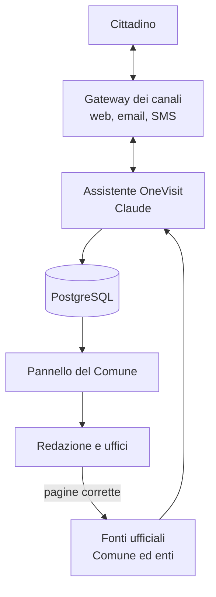
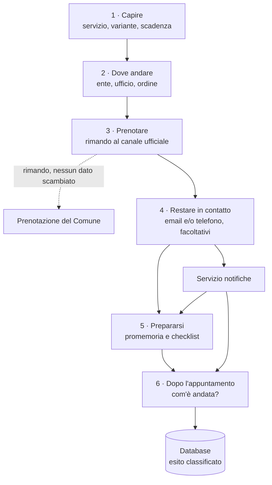
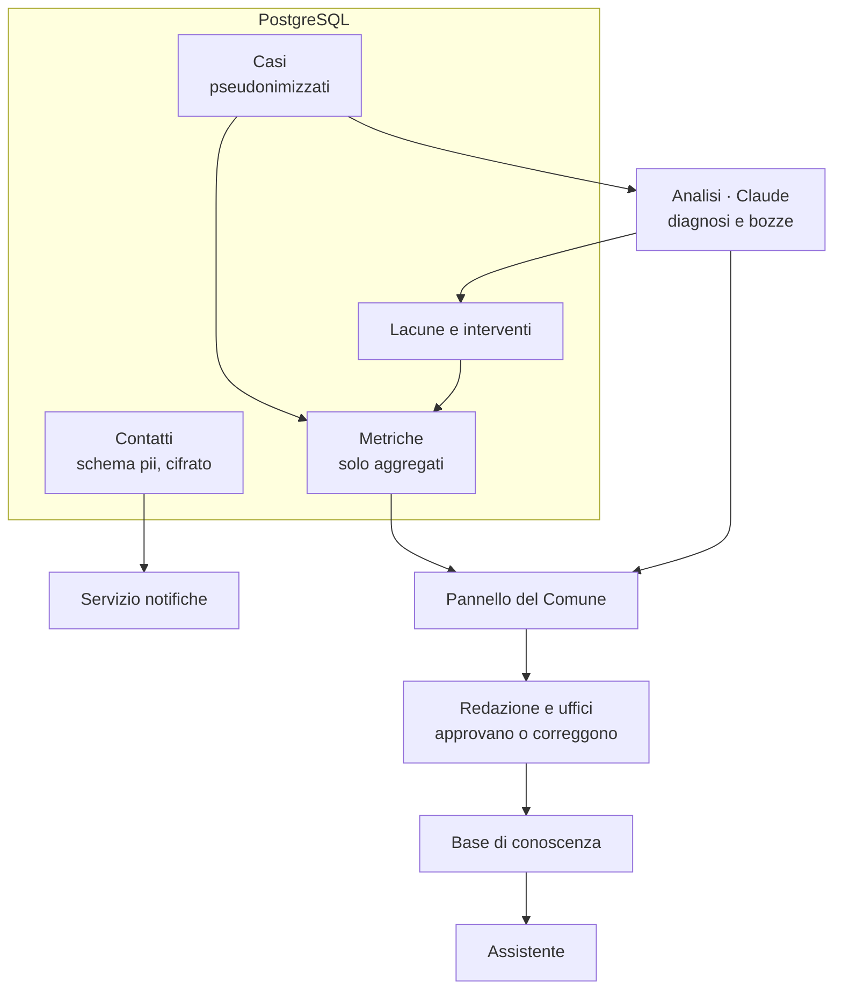
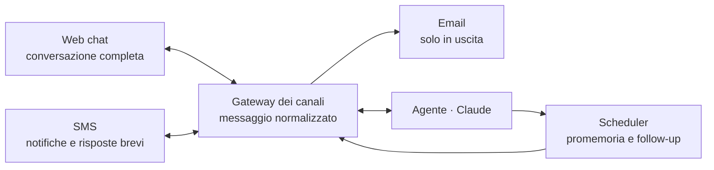

# OneVisit: un appuntamento, una pratica chiusa

*Concept per l'hackathon del Comune di Milano. È un documento di progetto: non contiene ancora l'implementazione. I criteri della giuria sono quelli emersi stamattina dall'analisi del brief e vanno ricontrollati sulle slide prima del pitch.*

## In una frase

OneVisit accompagna il cittadino dal bisogno allo sportello: quale servizio, quale ente, quale ufficio, come prenotare, cosa portare. L'obiettivo è che la pratica si chiuda al primo appuntamento. Ogni appuntamento andato male diventa un'informazione per il Comune, che vede in un pannello di metriche dove le sue procedure sono incomplete, superate o del tutto assenti, e quanto gli costa.

## Il problema

Chi va all'anagrafe per una carta d'identità, un cambio di residenza o un certificato scopre spesso allo sportello che manca qualcosa. Per il cittadino significa tornare e aspettare di nuovo. Per il Comune significa uno slot occupato senza chiudere la pratica, che un altro cittadino avrebbe potuto usare.

Il problema ha tre forme diverse. A volte la pagina c'è ma è **incompleta**. A volte c'è ma descrive una procedura **non più aggiornata**. A volte una pagina per quel caso **non esiste proprio**.

Chi ne soffre di più sono i cittadini extra-UE. Le loro pratiche coinvolgono più enti, richiedono documenti rilasciati all'estero e si scontrano con una barriera linguistica. Sono anche i casi che le pagine coprono peggio.

## Due prodotti, un sistema

OneVisit è fatto di due prodotti separati che condividono un database.

L'**assistente** è il bot usato dal cittadino. Lo guida nel percorso, controlla con lui i documenti prima dell'appuntamento e raccoglie com'è andata.

Il **pannello** è un'applicazione web riservata al personale del Comune di Milano, esterna al bot. Mostra cosa succede davvero agli sportelli: pratiche chiuse al primo colpo, problemi emersi, procedure da correggere, effetto delle correzioni, costi evitati.

In mezzo c'è un database PostgreSQL. È organizzato in livelli separati, così il pannello lavora solo su dati anonimi o aggregati (dettagli nella sezione sul database).

Davanti all'assistente c'è un gateway dei canali: lo stesso assistente parla con il cittadino sul web e lo ricontatta via email o SMS (dettagli nella sezione sui canali).

## Gli schemi del progetto

Quattro schemi, ognuno con uno scopo diverso. Sono scritti in Mermaid, quindi si vedono direttamente su GitHub e in molti editor Markdown.

### Schema 1 · Panoramica del sistema

**Obiettivo:** mostrare in un colpo d'occhio i componenti di OneVisit e come si chiude il ciclo di miglioramento. Serve per il pitch e per allineare il team prima di dividersi il lavoro.

### Schema 2 · Il percorso del cittadino

**Obiettivo:** descrivere fase per fase cosa succede al cittadino e dove passano i suoi dati. È il riferimento per le user story dell'assistente e per il test del percorso demo.

### Schema 3 · Dati e pannello del Comune

**Obiettivo:** mostrare come sono separati i dati e quale strada fa un esito per diventare una correzione approvata. È il riferimento per lo schema del database, per i ruoli di accesso e per la valutazione privacy.

### Schema 4 · Canali e connettori

**Obiettivo:** mostrare come ogni canale arriva allo stesso agente e quali messaggi partono da soli. È il riferimento per il gateway, gli adattatori e lo scheduler.

## Il percorso del cittadino

### 1. Capire cosa serve

Il cittadino descrive la situazione con parole sue, per esempio "ho perso la carta d'identità e tra un mese devo partire". L'assistente riconosce il servizio e la variante del caso, e fa solo le domande che cambiano la risposta. Una di queste riguarda la scadenza: "ti serve entro una data?". Quell'informazione permette poi di misurare se la pratica si è chiusa in tempo utile.

L'assistente non chiede nome, codice fiscale né documenti. Gli bastano i fatti della situazione.

Risponde nella lingua in cui il cittadino scrive fin dal primo messaggio, oppure in quella che il cittadino chiede (vedi la sezione sulla lingua).

### 2. Dove andare

L'assistente indica l'**ente** competente prima ancora dell'ufficio. Molte pratiche non sono del Comune, o non solo: il permesso di soggiorno spetta alla Questura, il codice fiscale all'Agenzia delle Entrate. Un cittadino extra-UE deve sapere in che ordine andare, non solo dove.

Per la parte comunale l'assistente indica l'ufficio, l'indirizzo, gli orari e la pagina ufficiale da cui ha preso l'informazione. Ogni indicazione riporta la fonte e la data in cui è stata verificata, perché un ufficio sbagliato provoca proprio il viaggio a vuoto che OneVisit vuole evitare.

### 3. Prenotare

L'assistente spiega come prenotare e cosa preparare, poi rimanda al sistema di prenotazione ufficiale. **Non prenota al posto del cittadino**: per prenotare bisogna identificarsi, e far passare la prenotazione dal bot gli darebbe dati di identità e credenziali che non gli servono.

### 4. Restare in contatto

Una volta prenotato, l'assistente chiede se il cittadino vuole essere ricontattato, e come: email, numero di telefono o entrambi. Lo chiede in questo momento e non all'inizio: ora il vantaggio è concreto, e chiedere un dato prima di aver dato qualcosa in cambio fa abbandonare molte persone.

Il contatto è **facoltativo**. Il cittadino sceglie il canale (vedi la sezione sui canali) e, separatamente, per cosa usarlo:

- promemoria dell'appuntamento e dei documenti;
- domanda su com'è andata;
- avviso quando la sua segnalazione ha portato a una correzione.

Chi non lascia nessun contatto riceve gli stessi promemoria come evento di calendario (.ics) sul proprio dispositivo. Il servizio funziona per intero anche così.

### 5. Prepararsi: il controllo prima dell'appuntamento

Qualche giorno prima arriva il promemoria, sul canale scelto o come evento di calendario, e apre il controllo. L'assistente ricostruisce l'elenco dei documenti per quel caso e lo verifica con il cittadino una voce alla volta: il documento è scaduto o smarrito? La denuncia è stata fatta? Il modulo è firmato? Un documento rilasciato all'estero ha la traduzione richiesta?

Ogni requisito è accompagnato dalla pagina da cui proviene e dalla data in cui è stato verificato. Quando le fonti non bastano, l'assistente lo dice.

L'assistente non dichiara mai i documenti "idonei". Dice che, secondo le fonti citate, risultano presenti tutti quelli richiesti. La valutazione resta all'operatore allo sportello.

### 6. Dopo l'appuntamento

Il giorno dopo l'appuntamento il cittadino riceve una domanda: com'è andata? Le risposte possibili sono tre: tutto a posto, mancava qualcosa, altro. Si aggiungono due domande brevi: se la pratica si è chiusa in tempo utile e se vuole lasciare un giudizio o un suggerimento.

Chi ha lasciato un contatto riceve la domanda sul canale scelto. Gli altri la trovano nell'assistente.

Il ciclo si chiude dopo. Quando una lacuna segnalata dal cittadino porta a una correzione, chi ha dato il consenso riceve un breve avviso: la pagina che l'aveva tratto in inganno è stata corretta. Costa poco e aumenta molto la fiducia e la disponibilità a rispondere la volta successiva.

## La lingua

L'assistente parla la lingua del cittadino, senza che debba cercare un'impostazione.

**Come sceglie la lingua.** Le regole, in ordine di priorità:

1. Se il cittadino chiede esplicitamente una lingua ("can we speak English?", "parlami in spagnolo"), l'assistente usa quella.
2. Altrimenti risponde nella lingua in cui il cittadino scrive, a partire dalla prima richiesta.
3. Il messaggio di benvenuto, scritto prima che il cittadino dica qualcosa, usa la lingua del dispositivo, e in mancanza l'italiano.

Il cittadino può cambiare lingua in qualsiasi momento, scrivendo in un'altra lingua o chiedendolo, e l'assistente lo segue. Un messaggio troppo breve per capirne la lingua, come "ok" o "grazie", non provoca un cambio.

**I termini ufficiali restano in italiano, accanto alla traduzione.** Per esempio: "permesso di soggiorno (residence permit)". Sono le parole scritte sui documenti e sui moduli, e quelle usate allo sportello: il cittadino deve riconoscerle anche se non parla italiano. Per la stessa ragione i moduli restano in italiano. L'assistente spiega nella lingua del cittadino come compilarli, campo per campo.

**La traduzione non sostituisce la fonte.** Ogni indicazione rimanda alla pagina ufficiale, in italiano o nella sua versione tradotta se il Comune ne pubblica una. L'assistente ne dà un riassunto nella lingua del cittadino.

**Un solo testo approvato, tradotto al momento.** Le correzioni approvate dalla redazione sono scritte in italiano, in italiano facile e in inglese. Per tutte le altre lingue l'assistente traduce al momento a partire dal testo approvato. Così non si creano versioni diverse della stessa regola che con il tempo si scostano l'una dall'altra.

**Lingue meno diffuse.** La qualità della traduzione non è uguale per tutte le lingue. Nelle lingue meno diffuse l'assistente avvisa che la traduzione può essere imprecisa, mantiene sempre il termine italiano accanto e propone l'inglese come alternativa.

**Messaggi e promemoria**, su qualsiasi canale, arrivano nella lingua usata nella conversazione. Per questo, se il cittadino lascia un contatto, insieme al contatto viene salvata la lingua preferita.

**Privacy.** La lingua può far intuire l'origine di una persona. Viene salvata nei contatti solo per inviare i messaggi nella lingua giusta. Nelle metriche compare solo in forma aggregata e sopra soglia, per misurare se chi non parla italiano chiude la pratica al primo appuntamento quanto gli altri. Non viene mai usata per decisioni sulla singola persona.

## Canali di contatto e connettori

Il cittadino sceglie come essere ricontattato: email, numero di telefono o entrambi. Sono tutti facoltativi.

**Le regole di scelta**

- Con l'email, promemoria e domande arrivano per email.
- Senza email ma con il numero di telefono, arrivano via SMS.
- Con email e telefono, il cittadino sceglie il canale principale. Se un invio fallisce, il servizio usa l'altro.
- Chi non lascia nessun contatto riceve i promemoria come evento di calendario (.ics).

**Dove si svolge la conversazione.** Il percorso completo si fa nella web chat. Email e SMS servono a ricontattare il cittadino: promemoria, controllo dei documenti, domanda su com'è andata. Ogni messaggio contiene un link personale che riapre la conversazione sul web nel punto giusto. Un gateway riceve i messaggi da ogni canale, li trasforma in un formato unico e li passa allo stesso agente: l'agente non sa da quale canale arriva il messaggio, sa solo cosa il canale permette.

| Canale | Conversazione completa | Promemoria e follow-up | Vincoli da progettare |
|---|---|---|---|
| Web chat | Sì | No, non può raggiungere il cittadino | Per i messaggi successivi serve email o SMS |
| Email | No, solo messaggi in uscita | Sì | Le risposte avvengono tramite pulsanti-link (tutto a posto, mancava qualcosa, altro) |
| SMS | Solo risposte brevi (1, 2, 3, STOP) | Sì | Costo per messaggio, testi brevi, mittente da configurare; per un testo libero l'SMS rimanda alla web chat |

**Connettori previsti.** Gli SMS passano da un fornitore con un'interfaccia di invio e ricezione. Nell'hackathon si usa un account di prova; in produzione il fornitore lo sceglie il Comune, preferibilmente con trattamento dei dati nell'Unione europea. L'email passa da SMTP, che in produzione sarebbe quello istituzionale del Comune. Ogni connettore implementa la stessa interfaccia: ricevere un messaggio, trasformarlo nel formato unico, inviare una risposta, dichiarare cosa sa fare. Cambiare fornitore o aggiungere un canale non tocca l'agente.

**Il contenuto delle notifiche è minimo.** Un SMS compare sullo schermo bloccato del telefono, dove chiunque può leggerlo. Per questo non nomina mai la pratica: niente "permesso di soggiorno" né "denuncia di smarrimento". Dice solo che c'è un appuntamento tra tre giorni e contiene un link personale per aprire la checklist. Il link è casuale, scade alla fine del follow-up e non richiede un account. La stessa regola vale per l'oggetto delle email.

**Privacy dei canali.** Numero di telefono ed email sono dati personali. Stanno nella stessa tabella cifrata, con le stesse scadenze. I fornitori di SMS ed email sono responsabili del trattamento e vanno indicati nell'informativa.

**In produzione: App IO.** È il canale ufficiale della pubblica amministrazione per i messaggi ai cittadini, e il Comune potrebbe già usarlo. Però indirizza i messaggi tramite codice fiscale, cioè un dato di identità che oggi OneVisit evita. Va valutato con il Comune come scelta consapevole, non come opzione predefinita.

## I cittadini extra-UE

Meritano una progettazione dedicata, non un'opzione in più. Le loro pratiche passano per più enti, in un ordine che conta. Spesso richiedono documenti rilasciati all'estero, che possono dover essere tradotti e legalizzati a seconda del caso. Infine si svolgono in una lingua che non è la loro.

Per OneVisit questo significa tre cose:

- Nella fase 2 l'assistente spiega la sequenza degli enti, non un singolo ufficio.
- Risponde nella lingua del cittadino secondo le regole della sezione precedente, e tiene accanto alla traduzione i termini ufficiali in italiano che il cittadino ritroverà sui moduli e allo sportello.
- Il pannello misura separatamente gli esiti di questi cittadini. Se chiudono la pratica al primo appuntamento molto meno degli altri, il Comune ha un problema di equità, e il pannello deve renderlo visibile.

Il dato serve a migliorare il servizio e solo in forma aggregata: non viene mai collegato al contatto né usato per decisioni sulla singola persona.

## Cosa può non funzionare nelle informazioni pubbliche

Ogni esito negativo passa da Claude, che lo assegna a una causa. Le cause sono sei, e ognuna ha un destinatario diverso.

| Causa | Esempio | Come emerge | Chi deve intervenire |
|---|---|---|---|
| Pagina incompleta | Manca un documento richiesto allo sportello | Più cittadini rimandati per lo stesso motivo | Redazione web |
| Procedura non aggiornata | La pagina descrive una regola superata | Richieste allo sportello diverse dalla pagina, o contrasto con una fonte nazionale più recente | Ufficio titolare della procedura |
| Procedura mancante | Nessuna pagina copre il caso, per esempio una variante per cittadini extra-UE | Domande a cui l'assistente non trova alcuna fonte | Ufficio titolare e redazione |
| Indicazione dell'ente o dell'ufficio sbagliata | Il cittadino va in un ufficio che non tratta quella pratica | Esito "ufficio sbagliato" | Redazione web |
| Pagina chiara ma non seguita | L'informazione c'era, il cittadino non l'ha colta | Requisito presente nella checklist ma mancante allo sportello | Nessuno: va migliorato l'assistente |
| Richiesta non prevista allo sportello | Viene chiesto un documento che la procedura non prevede | Il requisito non compare in nessuna fonte | Responsabile del servizio, per procedura e per sede |

Due attenzioni. L'ultima causa mostra differenze di comportamento tra sedi ed è molto utile, ma va riportata per procedura e per sede, mai per singolo dipendente. E alcuni requisiti sono fissati a livello nazionale: se la lacuna è nella norma e non nella pagina, il destinatario non è il Comune, e Claude deve capire a chi appartiene la fonte.

## Il ciclo di miglioramento

Claude toglie i dati personali da ogni esito, lo generalizza e lo raggruppa con quelli simili.

Le segnalazioni agli uffici non partono una per una, per due motivi. Un ufficio che riceve un'email per ogni cittadino scontento smette di leggerle in pochi giorni. E una segnalazione singola, anche senza nome, può essere ricondotta alla persona da chi gestisce l'agenda, cioè proprio dall'ufficio che la riceve. Per questo la segnalazione parte solo quando un gruppo supera una soglia, per esempio cinque casi in alcune settimane. Arriva all'ufficio competente con il numero dei casi, la causa, la pagina coinvolta e una bozza di correzione già scritta.

I gruppi sotto soglia non vanno persi. Il pannello li mostra alla redazione in una sezione a parte, con numero di casi, causa e pagina, così si può correggere prima che parta la segnalazione: per esempio quando la correzione è evidente, o quando il servizio è molto usato e anche pochi casi pesano. Per non perdere la protezione della soglia, questa vista non mostra sede né date dei singoli casi, solo il totale del periodo. E la vede la redazione, non l'ufficio che gestisce l'agenda.

Nessuna correzione viene pubblicata senza approvazione umana. Dopo l'approvazione, la correzione entra nella base di conoscenza dell'assistente e il pannello inizia a misurarne l'effetto.

## Il pannello del Comune

Il pannello è riservato al personale del Comune. L'accesso avviene con le credenziali aziendali e ogni ruolo vede ciò che gli serve:

- la redazione web vede le lacune sulle pagine;
- gli uffici vedono le segnalazioni sulle proprie procedure;
- la direzione vede le metriche complessive e i costi.

| Metrica | Cosa dice | Da dove viene |
|---|---|---|
| Pratiche chiuse al primo appuntamento | La qualità complessiva, per servizio, sede e categoria di cittadino | Esiti dopo l'appuntamento |
| Pratiche chiuse in tempo utile | Se il servizio arriva quando serve, non solo se arriva | Scadenza dichiarata ed esito |
| Lacune aperte, per causa e servizio | Dove intervenire per prime | Classificazione di Claude |
| Procedure mancanti più richieste | Quali bisogni non hanno nessuna risposta pubblica | Domande senza fonte |
| Tempo dalla prima segnalazione alla correzione | Quanto reagisce il Comune | Storico delle lacune |
| Effetto di ogni correzione | Se la correzione ha funzionato davvero | Esiti prima e dopo la correzione |
| Appuntamenti a vuoto evitati e costo risparmiato | L'impatto economico | Esiti confrontati con il dato storico del Comune |
| Divario tra cittadini extra-UE e gli altri | L'equità del servizio | Esiti aggregati per categoria |
| Pagine non verificate da tempo | Il rischio di dare informazioni vecchie | Data di verifica delle fonti |
| Soddisfazione | La qualità percepita | Domande dopo l'appuntamento |

**Il pannello non deve diventare l'esempio negativo del brief.** Una dashboard che si limita a contare le richieste è esattamente ciò che il brief cita per bocciare un progetto al test "spegni l'AI". Il valore del pannello sta nei contenuti che produce Claude: la causa di ogni lacuna, il destinatario giusto, la bozza di correzione, la misura dell'effetto, e una sintesi settimanale per la direzione, scritta in linguaggio semplice. Senza Claude restano i grafici.

**Il costo risparmiato va presentato come stima, e va detto.** Si calcola così: appuntamenti a vuoto evitati moltiplicati per il costo medio di uno slot, che deve fornire il Comune. Gli appuntamenti evitati si ottengono dal confronto con il dato storico. Questo confronto però sovrastima l'effetto, perché chi usa un assistente di questo tipo è probabilmente già più attento della media. Il confronto più solido è quello prima e dopo una singola correzione: vale per tutti i cittadini, non solo per chi usa il bot. Per questo nel pitch conviene presentare quel dato come prova principale e il costo complessivo come stima.

## Il database

PostgreSQL, organizzato in quattro livelli separati. Il pannello legge solo gli ultimi due.

| Livello | Contenuto | Chi accede | Per quanto |
|---|---|---|---|
| Contatti | Email e telefono (facoltativi), data e ora dell'appuntamento, canale preferito, lingua, consensi per ciascuna finalità, data di scadenza | Solo il servizio di notifica; tabella separata e cifrata | Fino alla fine del ciclo di follow-up, poi cancellata |
| Casi | Identificativo casuale, servizio, variante, categoria (UE o extra-UE), ente e sede, settimana dell'appuntamento, esito, causa | Solo la pipeline di analisi; nessun accesso diretto dal pannello | Quando il contatto viene cancellato il collegamento sparisce e le date vengono accorpate al mese |
| Lacune e interventi | Gruppi, causa, pagina, stato, bozza, correzione approvata e data | Redazione e uffici, tramite il pannello | Per tutta la vita del servizio |
| Metriche | Viste aggregate, senza celle sotto la soglia | Pannello | Per tutta la vita del servizio |

Le conversazioni non vengono salvate come testo. Claude ne estrae i campi strutturati (servizio, variante, esito, causa) e il testo libero viene scartato. Lo stesso vale per i suggerimenti: Claude li riassume, toglie i dati personali e salva solo la sintesi.

Finché esiste il collegamento con il contatto, un caso è pseudonimizzato e non anonimo: per il GDPR resta un dato personale. Diventa anonimo quando il collegamento viene cancellato e le date sono accorpate abbastanza da non permettere di risalire alla persona.

## Specializzare il sistema senza allenare il modello sui cittadini

L'obiettivo è che il sistema diventi più preciso grazie alle metriche. Lo strumento giusto per raggiungerlo però non è riaddestrare il modello sulle conversazioni dei cittadini. Ci sono tre motivi.

Il primo è giuridico. Usare per l'addestramento dati raccolti per prestare un servizio è una finalità diversa (art. 5 del GDPR). Le conversazioni sono difficili da anonimizzare davvero, e un modello addestrato non permette di cancellare il contributo di una singola persona.

Il secondo è pratico. Per un hackathon, e per un ente pubblico, riaddestrare un modello è costoso e lento da verificare.

Il terzo è che non serve. La specializzazione si ottiene in modo più controllabile in tre modi:

- le correzioni approvate entrano nella base di conoscenza da cui l'assistente risponde;
- i casi anonimi diventano un insieme di test, con cui ogni modifica dell'assistente viene verificata prima di andare in produzione;
- le metriche indicano quali istruzioni e quali fonti migliorare.

È un miglioramento tracciabile e reversibile, e ogni passo ha un responsabile umano.

## Dove lavora Claude quando qualcuno usa il servizio

Questa è la sezione obbligatoria del README.

| Momento | Cosa fa Claude | Conferma umana |
|---|---|---|
| Capire | Riconosce lingua, servizio e variante da una descrizione libera e sceglie solo le domande che cambiano la risposta | Il cittadino conferma il riepilogo del suo caso |
| Dove andare | Individua l'ente e l'ufficio competenti e l'ordine dei passaggi, con le fonti | Nessuna: è un'informazione con fonte |
| Prenotare | Prepara le informazioni utili e indica il canale ufficiale | Il cittadino prenota sul sistema del Comune |
| Prepararsi | Costruisce la checklist per quel caso e la verifica voce per voce con il cittadino | La valutazione finale spetta all'operatore |
| Dopo | Classifica l'esito in una delle sei cause, toglie i dati personali, estrae i campi strutturati | Nessuna: il dato non esce finché non si forma un gruppo |
| Pannello | Raggruppa i casi, individua il destinatario, scrive la bozza di correzione, misura l'effetto, scrive la sintesi settimanale | Redazione e uffici approvano o correggono |

**Test "spegni l'AI".** Senza Claude restano una pagina di link, un modulo di reclamo e una dashboard di conteggi. Con Claude si ottengono il caso compreso, l'ente individuato, una checklist su misura, la diagnosi delle lacune, la correzione proposta e la misura del suo effetto.

## Privacy e GDPR

Il principio resta lo stesso: l'assistente lavora sui fatti della situazione, non sui dati di identità. **L'unica eccezione è il contatto (email o telefono), ed è una scelta da dichiarare**, perché il brief chiede di non usare dati personali. La giustificazione è che il contatto è facoltativo, il servizio funziona per intero anche senza, e viene usato solo per le finalità che il cittadino sceglie.

| Dato | Dove sta | Chi lo vede | Per quanto |
|---|---|---|---|
| Descrizione della situazione | Nella sessione; al modello arriva il minimo necessario | Il modello | Non viene salvata come testo, solo come campi strutturati |
| Email e telefono (facoltativi) | Tabella contatti, separata e cifrata; al momento dell'invio anche presso il fornitore di SMS o email | Solo il servizio di notifica | Fino alla fine del follow-up |
| Lingua preferita | Nella sessione; nei contatti se il cittadino lascia un contatto; nelle metriche solo come aggregato | Servizio di notifica; il pannello solo in forma aggregata | Come il dato a cui è associata |
| Data e sede dell'appuntamento | Sul dispositivo, e nella tabella contatti se il cittadino sceglie i promemoria; nei casi solo la settimana | Solo il cittadino e il servizio di notifica | Fino alla fine del follow-up |
| Documenti | Non vengono mai caricati | Nessuno | — |
| Esiti e suggerimenti | Tabella casi, prima pseudonimizzati poi anonimi | Pipeline di analisi | Vedi la sezione sul database |
| Segnalazioni | Lacune e interventi | Uffici sopra soglia; redazione anche sotto soglia, senza sede né date | Per tutta la vita del servizio |
| Credenziali e prenotazione | Sistema ufficiale del Comune | Il Comune, come oggi | Fuori dal perimetro di OneVisit |

**Consenso e base giuridica.** Il cittadino dà il consenso separatamente per ogni finalità e può revocarlo da ogni messaggio, con un link o rispondendo STOP. La base giuridica va definita con il DPO del Comune: per un ente pubblico il consenso ha limiti propri, e una parte del trattamento potrebbe fondarsi sull'interesse pubblico.

**Diritti e decisioni.** L'assistente non prende decisioni con effetti sulla persona (art. 22 del GDPR). Il cittadino sa esplicitamente di parlare con un'intelligenza artificiale (art. 50 dell'AI Act) e riceve un'informativa breve.

**Fornitore del modello.** È responsabile del trattamento. Servono un accordo di trattamento e la verifica dei termini su conservazione dei dati, uso per l'addestramento e localizzazione.

**Valutazione d'impatto.** Con un database che collega contatti ed esiti, in produzione una DPIA va messa in conto. Riguarda anche il personale: il pannello non deve mai permettere di valutare i singoli dipendenti.

## Cosa ho aggiunto alla tua idea

| Miglioramento | Perché |
|---|---|
| Ente competente prima dell'ufficio, e ordine dei passaggi | Molte pratiche, soprattutto per i cittadini extra-UE, non sono solo del Comune |
| Domanda sulla scadenza e metrica "in tempo utile" | Misura se il servizio arriva quando serve, non solo se arriva |
| Contatto chiesto dopo la prenotazione, per finalità separate | Più adesioni e consenso specifico |
| Notifiche che non nominano la pratica | Lo schermo bloccato del telefono è visibile a chiunque |
| Un'unica interfaccia per tutti i connettori | Aggiungere un canale non tocca l'agente |
| App IO valutata come opzione, non come default | È il canale ufficiale della PA, ma richiede il codice fiscale |
| Avviso al cittadino quando la sua segnalazione ha portato a una correzione | Chiude il ciclo e aumenta le risposte future |
| Sei cause, ciascuna con il suo destinatario | Pagine incomplete, procedure superate e procedure mancanti richiedono interventi diversi |
| Misura prima e dopo ogni correzione | È la prova più solida che il sistema migliora il Comune |
| Costo risparmiato presentato come stima, con i suoi limiti | Una cifra gonfiata in un pitch alla PA si smonta con una domanda |
| Divario extra-UE nel pannello | Rende visibile un problema di equità, non solo di efficienza |
| Avviso sulle pagine non verificate da tempo | Previene invece di correggere |
| Termini ufficiali in italiano accanto alla traduzione | Il cittadino li ritrova sui moduli e allo sportello |
| Testo approvato in italiano, tradotto al momento | Una sola versione della regola, nessuna traduzione che resta indietro |
| Specializzazione tramite base di conoscenza e test, non addestramento | Più controllabile e compatibile con il GDPR |
| Sintesi settimanale scritta da Claude | Evita che il pannello diventi una dashboard di soli conteggi |

## Come risponde ai criteri dell'hackathon

| Criterio | Come risponde | Cosa curare |
|---|---|---|
| Impatto immediato (peso doppio) | Appuntamenti a vuoto evitati e costo stimato, visibili nel pannello | Il numero di partenza deve fornirlo il Comune |
| AI at work (peso doppio) | Claude lavora in ogni fase del percorso e nel pannello | Mostrare le varianti del caso e la diagnosi, non i conteggi |
| Città proattiva | Promemoria, controllo prima dell'appuntamento, domanda dopo | — |
| Punto unico di accesso | Tutto il percorso, da più enti, in un solo posto | — |
| Una città che impara | Lacune, correzioni approvate e loro effetto misurato | Mostrare un ciclo completo nella demo |
| Niente dati personali | Fatti e non identità; contatto facoltativo | Dichiarare esplicitamente nel pitch la scelta sul contatto |
| Accessibilità | Lingua del cittadino riconosciuta dal primo messaggio o scelta da lui; italiano facile; attenzione dedicata ai cittadini extra-UE | Mostrare nella demo un cambio di lingua a metà conversazione |
| Paura delle risposte sbagliate | Fonte e data per ogni indicazione; nessuna garanzia di idoneità | Mostrare un caso in cui l'assistente risponde "non lo so" |
| Connettori affidabili | Fonti ufficiali citate e con la data di verifica | Se c'è tempo, esporle come server MCP |

**Track.** Il progetto ha un fronte rivolto al cittadino e un cuore di back office. Il brief avverte che il Track 01, senza dati di identità, rischia di diventare una "FAQ più intelligente". Il pannello, invece, porta il progetto dentro al Track 03, "From inside City Hall". Conviene presentarlo lì, usando il percorso del cittadino per rendere visibile il beneficio, che è proprio l'avvertenza di quel track.

## Rischi e mitigazioni

| Rischio | Mitigazione |
|---|---|
| Indicazione di ente o ufficio sbagliata | Fonte e data di verifica; causa dedicata nelle segnalazioni |
| Pagine non aggiornate | Avviso sulle pagine non verificate da tempo; confronto con le fonti nazionali |
| Il cittadino si fida troppo dell'assistente | Nessuna garanzia di idoneità; l'assistente dichiara quando non sa |
| Raccolta di email o telefono contraria al vincolo del brief | Facoltativa, per finalità separate, servizio completo anche senza |
| Segnalazioni riconducibili alla persona | Soglia, date accorpate, collegamento con il contatto cancellato |
| Promemoria letti da altri sullo schermo bloccato | Testo che non nomina la pratica, dettagli solo dietro link |
| Costi degli SMS | SMS solo per notifiche e risposte brevi; email proposta per prima quando il cittadino ha entrambi |
| Fornitore SMS fuori dall'Unione europea | Interfaccia unica per i connettori; in produzione fornitore scelto dal Comune |
| Pannello usato per valutare i dipendenti | Dati per procedura e sede, mai per persona |
| Costi risparmiati sovrastimati | Presentati come stima; prova principale è il confronto prima e dopo |
| Lacune nella norma nazionale | Claude individua a chi appartiene la fonte prima di segnalare |
| Pochi cittadini rispondono dopo l'appuntamento | Tre risposte, un tocco; avviso sulle correzioni come incentivo |

## Perimetro per oggi

Il progetto è ora molto più ampio di quanto si possa costruire in una giornata, quindi va diviso.

| Fare davvero | Simulare | Rimandare |
|---|---|---|
| Assistente su due servizi: carta d'identità e iscrizione anagrafica di un cittadino extra-UE, con fonti citate | Prenotazione, con rimando al link ufficiale | Integrazione con il sistema di prenotazione |
| Classificazione degli esiti nelle sei cause | Risposte SMS in arrivo tramite tunnel pubblico verso l'ambiente locale | Fornitore SMS scelto dal Comune |
| SMS reale, con il promemoria che arriva sul telefono durante la demo | Email ricevute in una casella di prova locale | SMTP istituzionale e mittente SMS del Comune |
| PostgreSQL con i quattro livelli, popolato con dati sintetici | Storico del Comune per il confronto | Accesso con credenziali aziendali |
| Pannello con quattro metriche: chiuse al primo appuntamento, lacune per causa, effetto prima e dopo, costo stimato | Tempi compressi per lo scheduler (un giorno in un minuto) | Cancellazione automatica secondo le scadenze |
| Ciclo bozza, approvazione, nuova checklist | | Verifica della qualità nelle lingue meno diffuse |
| Lingua riconosciuta dal primo messaggio e cambio su richiesta: italiano, inglese e una terza lingua da concordare con il Comune | | |

Il dettaglio di ogni attività è nel backlog: `docs/backlog.md`.

## Il pitch in due minuti

Daniel è un ingegnere brasiliano appena assunto a Milano e deve iscriversi all'anagrafe. Racconta la sua situazione all'assistente, in inglese. L'assistente gli spiega quali passaggi sono della Questura e quali del Comune, in che ordine farli e come prenotare. Daniel prenota e sceglie di ricevere i promemoria via SMS. Tre giorni prima dell'appuntamento il controllo trova un documento rilasciato all'estero che va tradotto. Daniel lo fa in tempo e allo sportello chiude la pratica al primo colpo.

Intanto Marco, della redazione web, apre il pannello. Trova una procedura mancante: 14 persone in un mese hanno chiesto di quel caso e nessuna pagina lo copre. La bozza della nuova pagina è già scritta, lui la approva. Un mese dopo il pannello mostra che, per quel servizio, le pratiche chiuse al primo appuntamento sono aumentate, e quanto vale questo aumento in appuntamenti liberati.

Frase di chiusura: *il Comune non deve chiedersi dove sbaglia, glielo dicono gli appuntamenti.*

## Domande da fare al personale del Comune in sala

1. Misurate quanti appuntamenti non si chiudono per documentazione incompleta? Esiste un dato storico?
2. Quanto costa, anche solo come ordine di grandezza, uno slot allo sportello?
3. La prenotazione invia già una conferma via email o SMS a cui agganciare il servizio?
4. Esiste un elenco ufficiale degli uffici e delle loro competenze, magari come open data?
5. Chi aggiorna le pagine dei servizi, e come arrivano oggi le segnalazioni?
6. Ci sono differenze note tra sedi nei documenti richiesti?
7. Con chi andrebbe discussa la gestione dei contatti, per esempio il DPO?
8. Quali sono le lingue più diffuse tra i cittadini stranieri che si presentano agli sportelli?
9. Il Comune usa già canali di messaggistica verso i cittadini, come App IO o SMS? Con quale fornitore?
