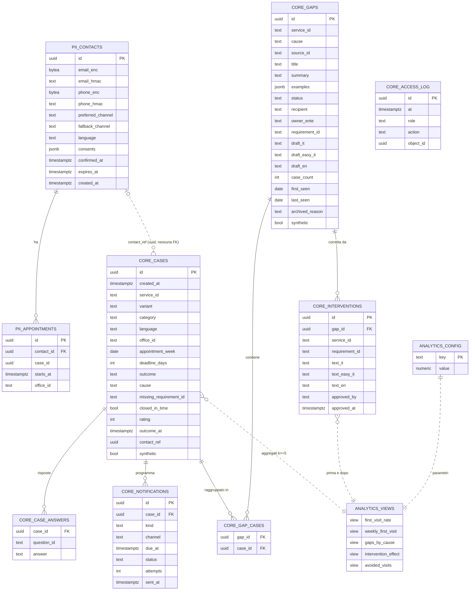

# Modello dei dati

*Storia A4. Riferimento vincolante: [contracts.md](contracts.md), sezione 4. Migrazioni: `libs/onevisit_db/src/onevisit_db/migrations/versions/` (`0001_baseline`, `0002_core_pii_analytics`). Privacy: [privacy.md](privacy.md).*

Tre schemi PostgreSQL, separati da ruoli diversi. La separazione tra contatti, casi e metriche è garantita dai permessi del database, non dalla buona volontà del codice: il ruolo del pannello riceve un errore se prova a leggere `pii.*` o `core.cases`.

| Schema | Contenuto | Dati personali |
|---|---|---|
| `pii` | Contatti cifrati e appuntamenti | Sì, cifrati (AES-256-GCM) con impronta HMAC per la ricerca |
| `core` | Casi pseudonimizzati, risposte strutturate, lacune, interventi, notifiche senza testo, registro accessi | Pseudonimizzati finché esiste `contact_ref`; nessun testo libero |
| `analytics` | Parametri e viste aggregate, con la soglia k applicata dentro la vista | No |

## Diagramma entità-relazioni

`core.cases.contact_ref` non ha una chiave esterna verso `pii.contacts` di proposito: quando il contatto viene cancellato il collegamento si azzera e il caso resta senza alcun riferimento alla persona.

## Ruoli

| Ruolo | Usato da | Permessi principali |
|---|---|---|
| `app_assistant` | `assistant_web`, `gateway` | Scrive `core.cases`, `core.case_answers`, `core.notifications`, `pii.*`; legge `core.interventions`, `analytics.config` |
| `app_notifier` | ciclo di invio (worker futuro) | Legge `pii.*`, `core.cases`; aggiorna `core.notifications` |
| `app_analysis` | analisi delle lacune | Legge `core.cases`, `core.case_answers`, `core.interventions`, viste `analytics`; scrive `core.gaps`, `core.gap_cases` |
| `app_dashboard` | `dashboard` | Legge solo `analytics.*`, `core.gaps`, `core.interventions`; aggiorna `core.gaps` e `analytics.config`; inserisce in `core.interventions` e `core.access_log`. **Errore su `pii.*` e `core.cases`** |
| `onevisit_owner` | migrazioni, CLI | Proprietario degli schemi; non usato dalle applicazioni |

## Tabelle

### `pii.contacts`

| | |
|---|---|
| Campi | `id`, `email_enc`, `email_hmac`, `phone_enc`, `phone_hmac`, `preferred_channel`, `fallback_channel`, `language`, `consents` (`{reminder, followup, correction}` → istante ISO o null), `confirmed_at`, `expires_at`, `created_at` |
| Chi scrive | `app_assistant` (B5: dopo la prenotazione, solo se il cittadino lo sceglie; revoca e cancellazione B9) |
| Chi legge | `app_assistant`, `app_notifier` (decifra solo al momento dell'invio) |
| Scadenza | `expires_at` = fine del ciclo di follow-up; poi cancellazione (`delete_contact`), che azzera `contact_ref` nei casi |
| Dati personali | **Sì**: email e telefono cifrati; `language` può suggerire l'origine |

### `pii.appointments`

| | |
|---|---|
| Campi | `id`, `contact_id` (FK), `case_id`, `starts_at`, `office_id` |
| Chi scrive / legge | `app_assistant` scrive; `app_assistant` e `app_notifier` leggono |
| Scadenza | Cancellata con il contatto |
| Dati personali | **Sì**: data, ora e sede legate a un contatto |

### `core.cases`

| | |
|---|---|
| Campi | `id`, `created_at`, `service_id`, `variant`, `category` (`italiana`/`ue`/`extra-ue`), `language`, `office_id`, `appointment_week` (lunedì della settimana), `deadline_days`, `outcome` (`ok`/`missing`/`other`/null), `cause` (una delle sei), `missing_requirement_id`, `closed_in_time`, `rating`, `outcome_at`, `contact_ref`, `synthetic` |
| Chi scrive | `app_assistant` (caso, appuntamento, esito); il gateway per le risposte SMS |
| Chi legge | `app_assistant`, `app_notifier`, `app_analysis`; **non** il pannello |
| Scadenza | Per tutta la vita del servizio, ma pseudonimizzato solo finché esiste `contact_ref`; dopo la cancellazione del contatto le date vanno accorpate al mese (da implementare, vedi privacy) |
| Dati personali | Pseudonimizzati finché c'è il collegamento; nessun testo libero, solo campi strutturati |

### `core.case_answers`

| | |
|---|---|
| Campi | `case_id` (FK), `question_id`, `answer` (id di opzione, mai testo) |
| Chi scrive / legge | `app_assistant` scrive; `app_analysis` legge |
| Scadenza | Come il caso |
| Dati personali | No (id di opzione del catalogo), ma concorrono alla pseudonimizzazione del caso |

### `core.gaps`

| | |
|---|---|
| Campi | `id`, `service_id`, `cause`, `source_id`, `title`, `summary`, `examples` (jsonb, generalizzati), `status` (`nuova`/`in-revisione`/`corretta`/`archiviata`), `recipient` (`redazione`/`ufficio`/`ente-nazionale`/`assistente`), `owner_ente`, `requirement_id`, `draft_it`, `draft_easy_it`, `draft_en`, `case_count`, `first_seen`, `last_seen`, `archived_reason`, `synthetic`, `created_at`, `updated_at` |
| Chi scrive | `app_analysis` (crea e aggiorna), `app_dashboard` (stato, archiviazione) |
| Chi legge | `app_analysis`, `app_dashboard` |
| Scadenza | Per tutta la vita del servizio |
| Dati personali | No: esempi generalizzati da Claude dopo la rimozione dei dati personali; sotto soglia la vista della redazione non mostra sede né date |

### `core.gap_cases`

| | |
|---|---|
| Campi | `gap_id`, `case_id` |
| Chi scrive / legge | `app_analysis` |
| Scadenza | Come il caso |
| Dati personali | No (collegamento tra identificativi opachi); il pannello non la legge |

### `core.interventions`

| | |
|---|---|
| Campi | `id`, `gap_id`, `service_id`, `requirement_id`, `text_it`, `text_easy_it`, `text_en`, `approved_by` (ruolo demo, mai un nome), `approved_at` |
| Chi scrive | `app_dashboard` (B11, approvazione della redazione) |
| Chi legge | `app_assistant` (overlay del catalogo), `app_analysis`, `app_dashboard` |
| Scadenza | Per tutta la vita del servizio |
| Dati personali | No |

### `core.notifications`

| | |
|---|---|
| Campi | `id`, `case_id`, `kind` (`reminder`/`followup`/`followup_nudge`/`correction_notice`/`revocation_confirm`/`email_confirm`), `channel` (`email`/`sms`), `due_at`, `status` (`scheduled`/`sent`/`failed`/`cancelled`), `attempts`, `sent_at`. **Nessun testo** |
| Chi scrive | `app_assistant` (programma), gateway e `app_notifier` (stato) |
| Chi legge | gateway, `app_notifier` |
| Scadenza | Fino alla fine del follow-up; le righe programmate vengono annullate alla revoca dei consensi |
| Dati personali | No da sole; legate al caso |

### `core.access_log`

| | |
|---|---|
| Campi | `id`, `at`, `role`, `action`, `object_id` |
| Chi scrive | `app_dashboard`, `app_assistant` |
| Chi legge | Proprietario / DPO |
| Scadenza | Da definire con il DPO (proposta: 12 mesi) |
| Dati personali | No: ruolo demo, mai il nome di un dipendente |

### `analytics.config`

| Chiave | Default | Significato |
|---|---|---|
| `k_threshold` | 5 | Numero minimo di casi per mostrare una cella aggregata |
| `cost_per_slot_eur` | 0 | Costo medio di uno slot allo sportello; lo fornisce il Comune |
| `window_weeks` | 4 | Settimane prima e dopo una correzione per misurarne l'effetto |

### Viste `analytics`

| Vista | Colonne | Filtro k |
|---|---|---|
| `first_visit_rate` | servizio, categoria, lingua → casi, chiusi al primo appuntamento, tasso | Righe con meno di k casi escluse |
| `weekly_first_visit` | servizio, settimana → casi, chiusi, tasso | Righe con meno di k casi escluse |
| `gaps_by_cause` | causa → lacune, lacune aperte, casi | `cases` null sotto k |
| `intervention_effect` | intervento → casi e tasso prima/dopo nella finestra | Valori null sotto k |
| `avoided_visits` | servizio → interventi, appuntamenti evitati stimati, costo stimato | Eredita il filtro da `intervention_effect` |

Definizioni e limiti delle metriche: [metrics.md](metrics.md).
